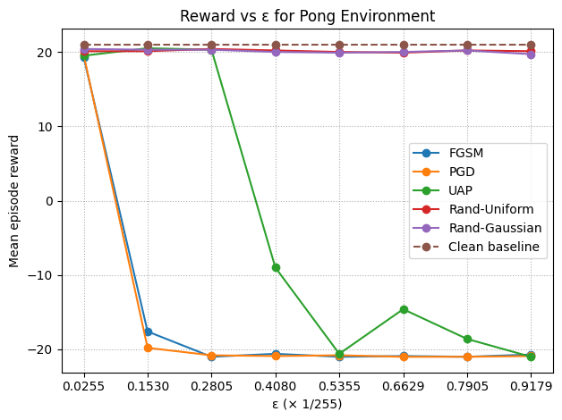
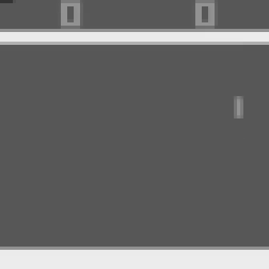
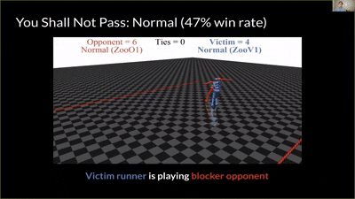
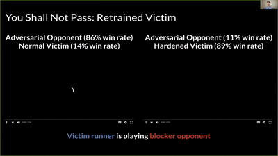
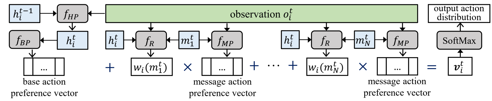

# Adversarial Attacks on Reinforcement Learning Policies

Reinforcement Learning (RL) has powered breakthroughs in games, robotics, and autonomous systems. But just like image classifiers can be fooled by carefully crafted adversarial examples, RL agents are also vulnerable to **adversarial attacks**. These attacks can manipulate the agent’s perception of the environment or its decision process, leading to unsafe or suboptimal behavior.

## What Do Adversarial Attacks Mean in RL?

In RL, an agent interacts with an environment, observes a state, takes an action, and receives a reward. An adversarial attack interferes with this process—often by perturbing the input observations—so the agent chooses actions that look reasonable to it but are actually harmful.

For example:

- A self-driving car policy might mistake a stop sign for a speed-limit sign if subtle noise is added to the camera input.
- A robot trained to walk could be tripped by slight modifications to its sensor readings.

## Types of Attacks in Reinforcement Learning

Researchers have identified several ways adversarial attacks can target RL policies. These attack vectors include:

1. **Observation Perturbation**

   The most widely studied form of attack: small, carefully crafted changes are made to the agent’s observations so it perceives the environment incorrectly.  

   *Example:* Adding imperceptible noise to frames in an Atari game so the agent misjudges its next move.
1. **Communication Perturbation**

   In multi-agent systems, communication messages can be perturbed, leading to miscoordination.  

   *Example:* Two drones sharing location data receive slightly altered coordinates, causing a collision.
1. **Malicious Communications**

   Beyond perturbations, adversaries may inject entirely fake or deceptive messages.  

   *Example:* An attacker sends a false signal about enemy positions in a cooperative strategy game.

## Why It Matters

Adversarial attacks highlight the gap between high-performing RL policies in controlled benchmarks and their reliability in the real world. Understanding and mitigating these vulnerabilities is essential if we want RL to be trusted in safety-critical domains like autonomous driving, robotics, and healthcare.

# How Vulnerable Are RL Policies to Adversarial Attacks?

Reinforcement Learning (RL) has made huge strides in recent years, powering systems that can beat human champions in games and control robots with precision. But just like image classifiers can be fooled by imperceptible changes to inputs, RL policies are also highly vulnerable to **adversarial attacks**

The researchers show that even tiny perturbations—so small they are invisible to humans—can cause RL agents to fail dramatically at test time. Using Atari games as a testbed, they evaluate three common deep RL algorithms: **DQN, TRPO, and A3C**. The results are clear: all three are susceptible, but **DQN policies are especially vulnerable**.

## White-Box Attacks with FGSM

In white-box scenarios, where the adversary has full access to the policy and gradients, attacks are devastating. The team applies the **Fast Gradient Sign Method (FGSM)** to craft adversarial examples and finds:

- An `ℓ∞`-norm perturbation with ε = 0.001 can slash performance by **over 50%**.  
- `ℓ1`-norm attacks are even more powerful—by changing just a handful of pixels significantly, they can cripple the agent’s performance.  

Even policies trained with robust algorithms like TRPO and A3C experience sharp drops when faced with these attacks.

## Black-Box Attacks and Transferability

What if the adversary doesn’t have full access to the policy network? Surprisingly, attacks are still effective. In **black-box settings**, adversaries exploit the property of **transferability**:

- Adversarial examples created for one policy often **transfer** to another policy trained on the same task.  
- Transferability also extends **across algorithms**—for example, attacks generated against a DQN policy can still reduce the performance of an A3C policy.  
- Effectiveness decreases with less knowledge, but performance still degrades significantly, especially with `ℓ1` attacks.  

## Why This Matters

The key takeaway is that **adversarial examples are not just a computer vision problem**. RL policies—despite achieving high scores in training—can be undermined by imperceptible perturbations. This fragility is dangerous for real-world applications like autonomous driving and robotics, where safety and reliability are non-negotiable.

## Universal Adversarial Preservation (UAP)

To ground these ideas, I re-implemented the 2017 Adversarial Attacks on Neural Network Policies setup (since there was no offical impelmentation) and trained a DQN agent on Atari Pong. After validating the baseline attacks, I implemented Universal Adversarial Perturbations (UAPs) and found that a single, fixed perturbation—computed once and then applied it to all observations, which was enough to consistently derail the policy across episodes and random seeds, without recomputing noise at every timestep. In other words, the attack generalized over time and trajectories, confirming that UAPs exploit stable perceptual quirks of the learned policy rather than moment-by-moment gradients. Practically, this feels much closer to a real-world threat model: an attacker only needs to tamper with the sensor once (think a sticker/overlay on the lens) instead of having high-bandwidth, per-step access to the system. Below you can see the plot of rewards vs ε bugdet and videos of different setups.

*baselines' reward over different values of ε budget.*

|  |  |  |  |  |
|:--:|:--:|:--:|:--:|:--:|
| *Clean — original episode (no perturbation).* | *Random uniform noise (ε = 2.0).* | *FGSM (ε = 2.0) — white-box attack.* | *PGD (ε = 2.0) — iterative, white-box attack.* | *UAP (ε = 2.0) — image-agnostic.* |

# Adversarial Policies: when weird opponents break strong RL

> **TL;DR.** Instead of adding pixel noise to an RL agent’s input, this paper shows you can train a *policy* that acts in the shared world to *induce natural but adversarial observations* for the victim—causing robust, self-play–trained agents to fail in zero-sum MuJoCo games. Fine-tuning helps…until a new adversary is learned.

---

## The threat model: natural observations as the “perturbation”

In multi-agent settings, an attacker typically can’t flip pixels or edit state vectors. But it **can** choose actions that make the victim *see* carefully crafted, physically plausible observations. Hold the victim fixed and the two-player game becomes a single-agent MDP for the attacker, who learns a policy that *elicits* bad actions from the victim.

**Quick look:**

|  |  | ") |  |
|:--:|:--:|:--:|:--:|
| *You Shall Not Pass* | *Kick & Defend* | *Sumo (Human)* | *Masked victim vs adversary* |

---

## Setup in a nutshell

- **Victims:** strong self-play policies (“agent zoo”) across four MuJoCo tasks: **Kick & Defend**, **You Shall Not Pass**, **Sumo Humans**, **Sumo Ants**.  
- **Attacker:** trained with **PPO** for ~**20M** timesteps—*\< 3%* of the 680–1360M timesteps used for the victims—yet reliably wins.  
- **Key idea:** adversaries don’t become great players; they learn poses/motions that generate **adversarial observations** for the victim.

**Figures**

*Tasks used for evaluation.*

*Adversary win rate rises quickly despite far fewer timesteps.*

---

## What the learned adversary *looks* like (and why that matters)

In **Kick & Defend** and **YSNP**, the adversary may **never stand up**—it finds contorted, stable poses that make the victim mis-act. In **Sumo Humans**, where falling loses immediately, it adopts a **kneeling/stable** stance that still provokes the victim to fall.

*Qualitative behaviors: the “point” is to confuse, not to excel at the nominal task.*

---

## Masking test: evidence the attack is observational

If wins come from **manipulating what the victim sees**, then hiding the adversary’s pose from the victim should help. That’s exactly what happens:

- Against normal opponents, the **masked victim** is (unsurprisingly) *worse*.  
- Against the **adversary**, the masked victim becomes **nearly immune** (e.g., in YSNP: normal victim loses often; masked victim flips the outcome and wins almost always).

*Masking the adversary’s position removes the observation channel the attack exploits.*

---

## Dimensionality matters

Victims are **more vulnerable when more opponent DOFs are observed**. The attack is stronger in **Humanoid** (higher-dimensional observed joints) than **Ant** (lower-dimensional). More controllable joints → more ways to steer the victim **off-distribution**.

*Higher observed dimensionality correlates with higher adversary win rates.*

---

## Why it works: off-distribution activations

Analyses of the victim’s network show adversarial opponents push internal activations **farther from the training manifold** than random or lifeless baselines.

*Adversarial policies drive “weird” activations—more off-distribution than simple OOD baselines.*

---

## Defenses (and their limits)

**Fine-tuning** the victim on the discovered adversary reduces that adversary’s success (often down to ~10% in YSNP), but:
- **Catastrophic forgetting:** performance vs normal opponents degrades (single-adversary fine-tune is worst; dual fine-tune helps but still regresses).
- **Arms race:** re-running the attack against the fine-tuned victim yields a *new* adversary that succeeds again—often via a different failure mode (e.g., tripping rather than pure confusion).

|  |  |
|:--:|:--:|
| *Before fine-tune* | *After fine-tune (this adversary)* |

*Win-rate grid before/after fine-tuning against normal opponents and adversaries.*

---

## Takeaways for practitioners

- **Threat model upgrade:** in multi-agent worlds, your attack surface includes other policies that craft **natural observations**—no pixel hacks needed.  
- **Exploitability check:** training a targeted adversary **lower-bounds** your policy’s worst-case performance and reveals failure modes missed by self-play.  
- **Defense needs diversity:** fine-tuning on a single adversary overfits. Prefer **population-based** or curriculum defenses that rotate diverse opponents and maintain competence vs normals.

# Robust Communicative Multi-Agent Reinforcement Learning with Active Defense

**By Yu et al., AAAI 2024**

### 🌐 Why Communication Matters in Multi-Agent RL

In multi-agent reinforcement learning (MARL), agents often face **partial observability** — no single agent sees the full environment. To cooperate effectively, agents need to **communicate**, sharing information about what they see and what actions to take.  

This communication has powered applications such as **robot navigation** and **traffic light control**.

But there’s a catch: in the real world, communication channels are **noisy** and **vulnerable to adversarial attacks**. If attackers tamper with even a few messages, the performance of MARL systems can collapse.  

---

### 🛡️ Enter Active Defense: The Core Idea

Yu et al. propose a **new active defense strategy**. Instead of blindly trusting all messages, agents:

1. **Judge the reliability** of each incoming message using their own observations and history (hidden states).  
2. **Adjust the influence** of unreliable messages by reducing their weight in the decision process.

👉 Example: If one agent already searched location (1,1) and found nothing, but receives a message saying “Target at (1,1)”, it can spot the inconsistency and downweight that message.

---

### 🧩 The ADMAC Framework

The authors introduce **Active Defense Multi-Agent Communication (ADMAC)**, which has two key components:

- **Reliability Estimator**: A classifier that predicts whether a message is reliable (weight close to 1) or unreliable (weight close to 0).  
- **Decomposable Message Aggregation Policy Net**: A structure that breaks down the influence of each message into an **action preference vector**, making it possible to scale its impact up or down.

This allows agents to **combine their own knowledge with weighted messages** to make more robust decisions.

The figure above shows how an agent in the **ADMAC framework** generates its action distribution by combining its own observations with incoming messages from other agents:

1. **Hidden state update**: The agent maintains a hidden state (`hᵢᵗ⁻¹`), which is updated using the observation (`oᵢᵗ`) through the GRU module `f_HP`. This captures past and current information.  
2. **Base action preference**: From the updated hidden state, the agent generates a **base preference vector** via `f_BP`, representing what it would do independently.  
3. **Message influence**: Each received message (`m₁ᵗ, …, m_Nᵗ`) is processed with the observation through `f_MP`, producing a **message-based action preference vector**.  
4. **Reliability estimation**: A reliability estimator `f_R` evaluates each message, assigning it a weight `wᵢ(mⱼᵗ)` that reflects how trustworthy it seems.  
5. **Aggregation**: The agent sums its base vector with all weighted message vectors to form a **total action preference vector (`vᵢᵗ`)**.  
6. **Final decision**: Applying a Softmax function converts this vector into a probability distribution over actions, from which the agent selects its next move.

By **downweighting unreliable messages**, ADMAC enables agents to remain robust against malicious communication while still leveraging useful information from peers.

---

References: 
1. Huang, S. H., Papernot, N., Goodfellow, I. J., Duan, Y., & Abbeel, P. (2017). Adversarial Attacks on Neural Network Policies.
2. Gleave, A., Dennis, M., Kant, N., Wild, C., Levine, S., & Russell, S. (2019). 
3. Adversarial Policies: Attacking Deep Reinforcement Learning.
Yu, L., Qiu, Y., Yao, Q., Shen, Y., Zhang, X., & Wang, J. (2023). 
4. Robust Communicative Multi-Agent Reinforcement Learning with Active Defense. 
Guo, W., Wu, X., Huang, S., & Xing, X. (2021). Adversarial Policy Learning in Two-player Competitive Games. 
5. https://www.youtube.com/watch?v=-_j-fmVpn_s
6. https://rll.berkeley.edu/adversarial/
