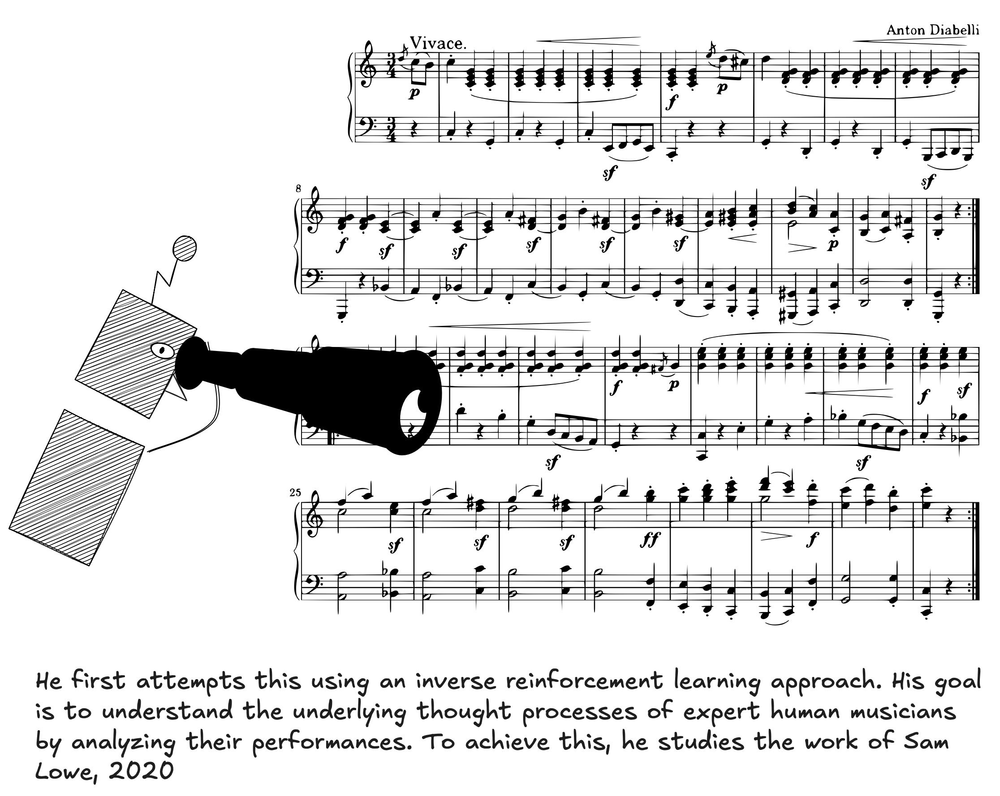

# Teaching “MammadAI” to Compose — From Noise to Music with RL

## Abstract  
This blog post describes a multi-stage project in which MammadAI, a robot musician, evolves from producing random noise to composing music aligned with human preferences. The progression moves through imitation learning, reinforcement learning with music theory constraints, and finally reinforcement learning from human feedback (RLHF). Drawing on prior studies — including Google’s work in 2016 and in 2024 — this post presents methodology, results, and implications for music generation.

---

## 1. Introduction  
Machine learning models have made strong progress in generating music, but they still struggle with long-term structure, audience feedback, and matching what humans like. MammadAI is a model used to explore how combining different learning approaches can overcome these challenges. The three main phases are:

1. Learning from demonstrations (imitation learning) to get a sense of musical style and structure.  
2. Using music theory constraints via reinforcement learning (RL) to impose rules.  
3. Aligning outputs with human preferences via RLHF (reinforcement learning from human feedback).

---

## 2. Imitation Learning & Early Challenges  

- **Problem**: Pure generative models often lack long-term musical structure. They don’t improve based on audience feedback, and defining a reward function for music is hard.  

- **Solution**: Use imitation learning (for example, GAIL) to learn a reward function from demonstrations.  

- **Setup**:  
  - A dataset of **10 melodies** and **5 rhythmic accompaniments**.  
  - States defined in several ways:  
    1. A 128-dimensional binary snapshot of the current 16th note (which pitches just played).  
    2. A 128-dimensional vector counting how many times each pitch has been played so far.  
    3. Similar, but giving lower weight to notes played a long time ago.  
  - Actions correspond to 89 possible piano notes + a “silent” action.  

- **Outcome**: The model begins to make sounds that feel musical, but still quite far from satisfying human standards.

---

## 3. Reinforcement Learning + Music Theory (Google, 2016)  

- In 2016, **Google’s Magenta team** introduced a method to combine generative models (Note-RNN) with reinforcement learning. The RL algorithm used was **DQN (Deep Q-Network)**. 

- **Reward**: Two parts  
  1. A term preserving what the model learned from data (probability from the Note RNN).
  2. A *music theory reward* enforcing constraints, such as: staying in one key, beginning and ending on tonic, avoiding excessive repetition, avoiding very large leaps, having distinct highest and lowest notes, encouraging motifs and their repetition, etc.

- **Results**: Compared to the pure Note-RNN, the RL-tuned model improved significantly on behaviors defined in music theory (such as fewer out-of-key notes, fewer repeated notes, etc.). Listeners preferred the RL-tuned versions. :contentReference

---

## 4. Reinforcement Learning from Human Feedback (RLHF) & Music Language Models (Google, 2024)  

- More recently, Google (2024) introduced **MusicRL**, built by fine-tuning a pretrained music language model called MusicLM with human feedback. 

- **How it works**:  
  - MusicLM is trained on pairs of captions (text prompts) and melodies. This lets it generate music in response to prompts. 
  - To handle the fact that users may dislike what it generates, they build a *reward model*. The reward model takes a prompt + a generated piece and outputs a scalar showing how much users prefer that output. 
  - Training the reward model involves showing humans two generated versions for the same prompt; asking which one they prefer; repeating this many times to build a dataset of pairwise preferences. 

- **Algorithm**: They used **PPO (Proximal Policy Optimization)** to fine-tune the MusicLM model using the reward model. 

- **Results**:  
  - Models fine-tuned with RLHF (MusicRL-R, MusicRL-U, MusicRL-RU) perform significantly better than the baseline MusicLM according to human raters. :contentReference
  - The combination of text adherence, audio quality, and user preference signals leads to the best overall performance. 

---

## 5. Implications & Lessons  

- Combining **generative modeling** with reinforcement learning helps address issues like structure and followability in music.  
- Embedding **music theory** as reward constraints is effective: it reduces undesirable behaviors and improves musicality.  
- Human feedback is essential: what sounds “good” is subjective. RLHF allows the model to adapt to human taste, not just formal rules.  
- The multi-stage approach (from imitation learning to theory-driven RL to RLHF) seems promising because each stage fixes some but not all problems.  

---

## 6. Conclusion  

MammadAI’s journey — from imitation learning to theory-based reinforcement to human-preference alignment — mirrors the evolution of music generation research. The latest results with RLHF show that we can build systems that don’t just obey rules, but also produce music people genuinely prefer.

There are still open challenges: balancing creativity versus coherence; ensuring variety without losing style; extending to more instruments, rhythms, and genres; adapting to diverse listeners. But the advances so far suggest the gap between machine-made and human-loved music is steadily closing.

---

## References  

Lowe, Sam. _An Inverse Reinforcement Learning Approach to Generative Music._ 2020. https://doi.org/10.17615/nmvf-e943

Jaques, Natasha, Shixiang Gu, Dzmitry Bahdanau, José Miguel Hernández-Lobato, Richard E. Turner, and Douglas Eck. “Sequence Tutor: Conservative Fine-Tuning of Sequence Generation Models with KL-Control.” _arXiv_, 2017, [https://arxiv.org/abs/1611.02796](https://arxiv.org/abs/1611.02796).

Kotecha, Nikhil. “Bach2Bach: Generating Music Using a Deep Reinforcement Learning Approach.” _arXiv_, 2018, [https://arxiv.org/abs/1812.01060](https://arxiv.org/abs/1812.01060)

Agostinelli, Andrea, Timo I. Denk, Zalán Borsos, Jesse Engel, Mauro Verzetti, Antoine Caillon, Qingqing Huang, Aren Jansen, Adam Roberts, Marco Tagliasacchi, Matt Sharifi, Neil Zeghidour, and Christian Frank. “MusicLM: Generating Music From Text.” _arXiv_, 2023, [https://arxiv.org/abs/2301.11325](https://arxiv.org/abs/2301.11325)

Cideron, Geoffrey, Sertan Girgin, Mauro Verzetti, Damien Vincent, Matej Kastelic, Zalán Borsos, Brian McWilliams, Victor Ungureanu, Olivier Bachem, Olivier Pietquin, Matthieu Geist, Léonard Hussenot, Neil Zeghidour, and Andrea Agostinelli. “MusicRL: Aligning Music Generation to Human Preferences.” _arXiv_, 2024, [https://arxiv.org/abs/2402.04229](https://arxiv.org/abs/2402.04229?utm_source=chatgpt.com).

