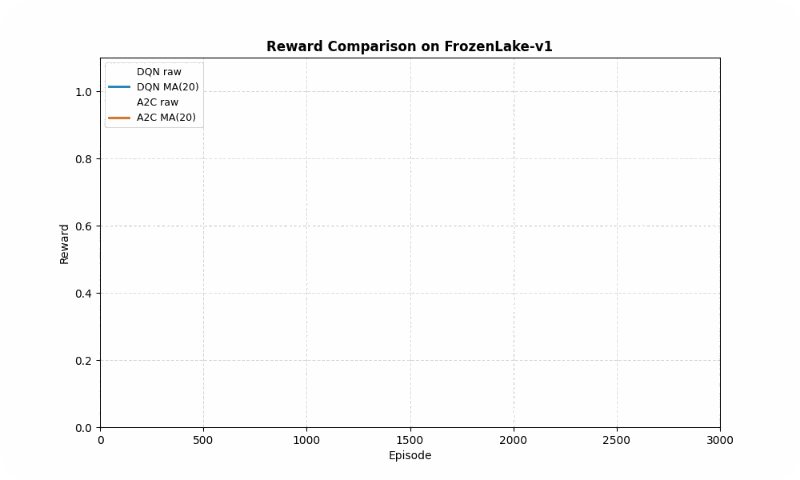
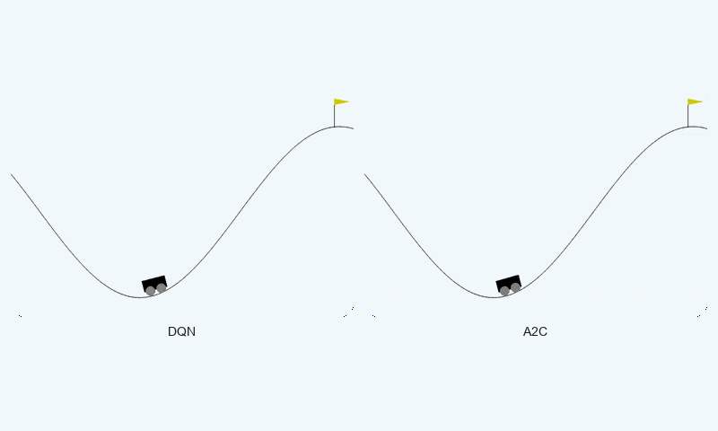
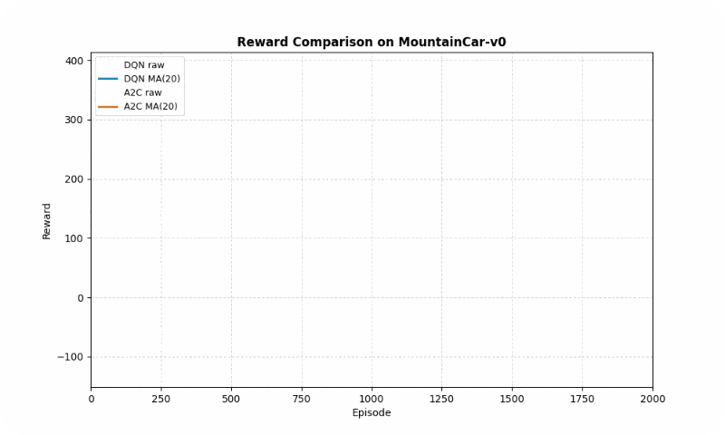
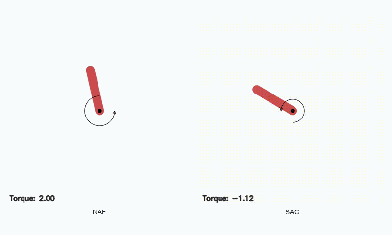
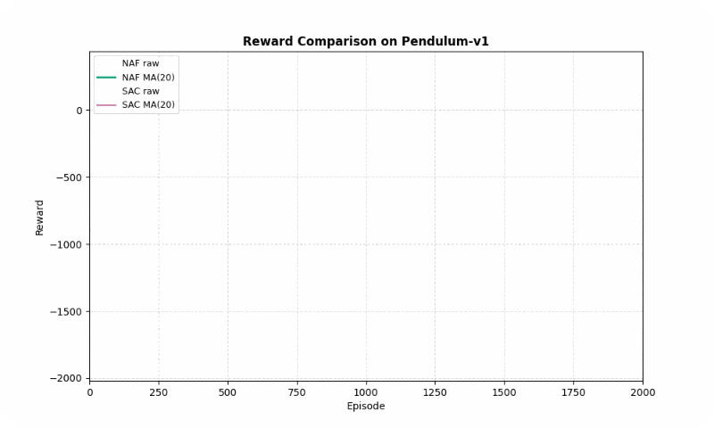
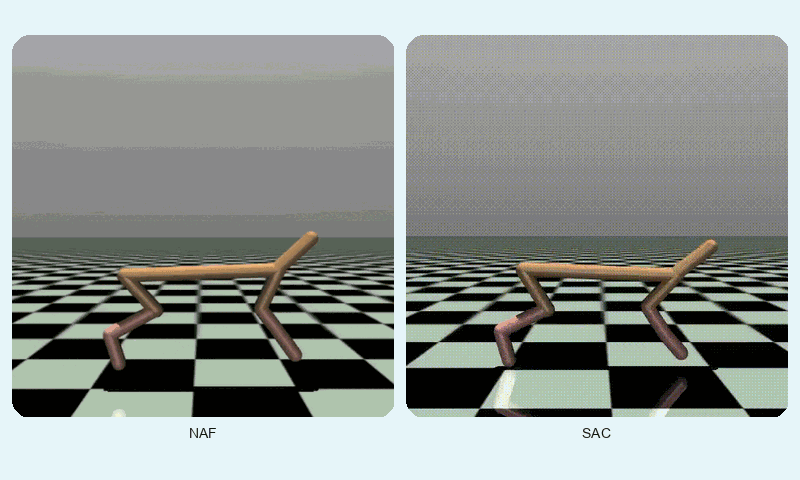
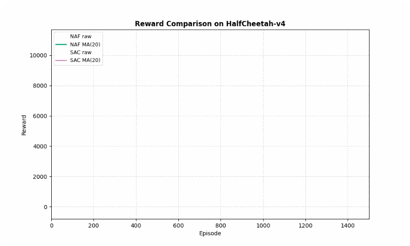

# Actor-Critic vs. Value-Based: Empirical Trade-offs 

## Introduction

In **Reinforcement Learning (RL)**, one of the fundamental questions is:  
*Should we focus on learning the value of states, or should we directly learn the optimal policy?*


Before diving into this comparison, let’s briefly recall what RL is: a branch of machine learning in which an **agent** interacts with an environment to learn how to make decisions that maximize **cumulative reward**.

Traditionally, RL algorithms fall into two main families:  
- **Value-Based methods** : which aim to estimate the value of states or state–action pairs.  
- **Policy-Based methods** : which directly optimize a policy that maps states to actions.  

**Actor-Critic algorithms** combine the strengths of both worlds, simultaneously learning a value function and an explicit policy. This hybrid structure can often lead to more stable and efficient learning.

Value-Based and Actor-Critic approaches represent fundamentally different perspectives: one focuses solely on learning state values, while the other integrates both value and policy learning. Comparing these two perspectives helps us better understand the impact of incorporating value or policy components in different environments.

In this project, we empirically evaluate these two families in both **discrete** and **continuous** action spaces. Four representative algorithms ( **DQN**, **A2C**, **NAF**, and **SAC** ) were implemented, along with a user-friendly **graphical user interface (GUI)** for training and evaluation.  
Our ultimate goal is to analyze trade-offs such as **convergence speed**, **learning stability**, and **final performance** across diverse scenarios.

## Background

The reinforcement learning algorithms used in this project fall into two main families:

**Value-Based**  
In this approach, the agent learns only a value function, such as $Q(s, a)$.  
The policy is derived implicitly by selecting the action with the highest value:  

$\pi(s) = \arg\max_a Q(s,a)$

This method is typically simpler, more stable, and computationally efficient.  
However, it faces limitations when dealing with **continuous action spaces**.  
Example algorithms: **DQN**, **NAF**.  

Value-Based methods are often well-suited for **discrete action spaces** with relatively small state–action domains, where enumerating or approximating the value for each action is feasible.  


**Actor-Critic**  
In this framework, the agent consists of two components:  

- **Actor** : a parameterized policy that directly produces actions.  
- **Critic** : a value function that evaluates the Actor’s performance and guides its updates.  

This combination can provide **greater learning stability**, improved performance in complex environments, and high flexibility in continuous action spaces.  
Example algorithms: **A2C**, **SAC**.  

Actor-Critic methods are generally more suitable for **continuous or high-dimensional action spaces**, as the Actor can output actions directly without exhaustive value estimation.  


## Methodology

### Project Design
This project was designed to perform an **empirical comparison** between two major families of reinforcement learning algorithms: **Value-Based** and **Actor-Critic**.  
Four representative algorithms were selected and implemented in diverse **discrete** and **continuous** environments.  
Training, evaluation, and comparison were carried out through a fully interactive, **user-friendly graphical interface**.

### Implemented Algorithms

Representative algorithms from the two families were selected based on their reported performance in different environments according to the literature.  
For each algorithm, the training procedure was reproduced in accordance with its original paper.  
The overall structure of each algorithm is summarized below:


| Algorithm | Family        | Action Space | Description | Reference |
|:---------:|:------------:|:------------:|:-----------:|:---------:|
| **Deep Q-Network (DQN)** | Value-Based  | Discrete     | Uses *experience replay* and a fixed *target network* to stabilize learning. | [1](https://www.nature.com/articles/nature14236) |
| **Normalized Advantage Function (NAF)** | Value-Based  | Continuous  | Value-based method for continuous spaces using a specific Q-structure to simplify action selection. | [2](https://arxiv.org/abs/1603.00748) |
| **Advantage Actor-Critic (A2C)** | Actor-Critic | Discrete/Continuous | Direct policy optimization guided by an *advantage function*. | [3](https://arxiv.org/abs/1602.01783) |
| **Soft Actor-Critic (SAC)** | Actor-Critic | Continuous  | Off-policy actor-critic method maximizing entropy for stability in complex environments. | [4](https://arxiv.org/abs/1801.01290) |

#### Deep Q-Network (DQN)


*The pseudocode of DQN highlights the use of **experience replay** and a **target network**, which together reduce correlations between samples and stabilize training.*


#### Normalized Advantage Function (NAF)


*NAF handles **continuous action spaces** by constraining the Q-function into a quadratic form, which makes action selection computationally efficient.*


#### Advantage Actor-Critic (A2C)


*A2C directly optimizes a parameterized policy (Actor) with guidance from the Critic, using **advantage estimation** to reduce gradient variance and improve learning stability.*


#### Soft Actor-Critic (SAC)


*SAC introduces **entropy maximization** in the objective, encouraging exploration and robustness in complex continuous environments.*


### Environments

There were many 2D and 3D environments available so that we could compare them.  
The 12 famous environments are listed below:


Four environments from the Gym library were selected to provide a **diverse set of challenges** that cover both **discrete** and **continuous action spaces**, as well as varying levels of **complexity and dynamics**:

- **MountainCar-v0** (Discrete): A classic control problem where the agent must drive a car up a hill using discrete acceleration commands. This environment tests **basic exploration and planning** in a low-dimensional, discrete action space.
- **Pendulum-v1** (Continuous): Requires applying continuous torque to keep a pendulum upright. This environment is ideal for evaluating **continuous control algorithms** and stabilizing dynamics.
- **FrozenLake-v1** (Discrete): A gridworld task where the agent navigates an icy lake to reach a goal while avoiding holes. This environment emphasizes **decision-making under uncertainty** in a discrete setting.
- **HalfCheetah-v4** (Continuous): A high-dimensional continuous control environment where the agent controls a bipedal cheetah to run efficiently. It challenges **advanced continuous control and balance strategies**.

These environments were chosen to allow a **comprehensive comparison** of algorithms across different **action types, state complexities, and control challenges**.

| Environment | Type       | Description |
|:-----------:|:---------:|:-----------:|
| **MountainCar-v0** | Discrete   | Drive a car up a hill by controlling acceleration in a discrete space. |
| **Pendulum-v1**    | Continuous | Apply torque to keep a pendulum upright and stable. |
| **FrozenLake-v1**  | Discrete   | Navigate an icy grid to reach the goal without falling into holes. |
| **HalfCheetah-v4** | Continuous | Control the speed and balance of a simulated bipedal cheetah for fast running. |

Environment snapshots were recorded during training and appear as GIFs in the Results section.

#### Configuration and Evaluation
- Algorithms were run with optimized settings for each environment.  
- Key hyperparameters (learning rate, γ, batch size, buffer size) were tuned through trial-and-error, leveraging existing GitHub implementations for optimal performance.  
- Comparisons were based on **convergence speed**, **training stability**, and **final performance**.

**Example configurations:**

| Algorithm | Environment  | γ    | Learning Rate | Batch Size | Buffer Size |
|:---------:|:-----------:|:----:|:-------------:|:----------:|:-----------:|
| **DQN**  | FrozenLake   | 0.93 | 6e-4          | 32         | 4,000       |
| **A2C**  | MountainCar  | 0.96 | 1e-3          | –          | –           |
| **NAF**  | Pendulum     | 0.99 | 3e-4          | 64         | 400,000     |
| **SAC**  | HalfCheetah  | 0.99 | 3e-4          | 256        | 1,000,000   |

### Graphical User Interface (GUI)

A user-friendly GUI was developed to simplify training and comparing algorithms, enabling full project execution without direct coding.The code is available at: [This Github Link](https://github.com/Foad-Hassanlou/RL-SimGUI) The project structure is as follows:

```
Project_Code/
├── plots/
│   └── learning_curves/
│   │   ├── Continuous/
│   │   │    ├── Pendulum-v1/
│   │   │    │   ├── SAC/
│   │   │    │   └── NAF/
│   │   │    └── HalfCheetah-v4/
│   │   │       ├── SAC/
│   │   │       └── NAF/
│   │   └── Discrete/
│   │       ├── FrozenLake-v1/
│   │       │   ├── DQN/
│   │       │   │   ├── 4x4
│   │       │   │   └── 8x8
│   │       │   └── A2C/
│   │       │       ├── 4x4
│   │       │       └── 8x8
│   │       └── MountainCar-v0/
│   │           ├── DQN/
│   │           └── A2C/
│   ├── comparison_table.png
│   └── directory_structure.png
├── requirements/
│   ├── base.txt
│   ├── dev.txt
│   ├── env.txt
│   └── config.py
├── src/
│   ├── agents/
│   │   ├── a2c.py
│   │   ├── dqn.py
│   │   ├── naf.py
│   │   └── sac.py
│   ├── envs/
│   │   ├── continuous_envs.py
│   │   └── discrete_envs.py
│   ├── main.py
│   ├── train.py
│   └── utils.py
├── videos/
│   ├── Continuous/
│   │    ├── Pendulum-v1/
│   │    │   ├── SAC/
│   │    │   └── NAF/
│   │    └── HalfCheetah-v4/
│   │       ├── SAC/
│   │       └── NAF/
│   └── Discrete/
│       ├── FrozenLake-v1/
│       │   ├── DQN/
│       │   │   ├── 4x4
│       │   │   └── 8x8
│       │   └── A2C/
│       │       ├── 4x4
│       │       └── 8x8
│       └── MountainCar-v0/
│           ├── DQN/
│           └── A2C/
├── models/
│   ├── Continuous/
│   │    ├── Pendulum-v1/
│   │    │   ├── SAC/
│   │    │   └── NAF/
│   │    └── HalfCheetah-v4/
│   │       ├── SAC/
│   │       └── NAF/
│   └── Discrete/
│       ├── FrozenLake-v1/
│       │   ├── DQN/
│       │   │   ├── 4x4
│       │   │   └── 8x8
│       │   └── A2C/
│       │       ├── 4x4
│       │       └── 8x8
│       └── MountainCar-v0/
│           ├── DQN/
│           └── A2C/
└── README.md
```

**Main features:**

- Select algorithm, environment, action space type (discrete/continuous), and execution mode (train/test) with just a few clicks.
- Launch training with a *Run* button, and view results via *Show Plots* and *Show Videos*.
- Compare algorithms interactively using a dedicated **Compare Algorithms** window.
- Display key settings such as hyperparameters and project structure.
- Real-time console output for monitoring execution status and system messages.


### Interactive Mobile Application

In addition to the desktop GUI, a **mobile application for Android and iOS** has been developed to provide interactive access to the project. By simply **scanning the poster**, users can explore various features, including:

- Viewing videos of agent executions in different environments.
- Opening the project’s website for additional resources and documentation.
- Displaying the poster digitally for interactive exploration.
- Comparing learning curves and results across different algorithms.

The images below showcase some sections of the app interface:


## Results

This section presents the empirical evaluation of four reinforcement learning algorithms (**DQN**, **NAF**, **A2C**, and **SAC**) from the **Value-Based** and **Actor-Critic** families, across both **discrete** and **continuous** action space environments. The performance is analyzed based on **final reward**, **convergence speed**, and **training stability**, supported by quantitative metrics, qualitative visualizations (GIFs), and learning curves with a moving average (MA) applied to reduce noise. The experiments were conducted using the Gymnasium library, with optimized hyperparameters (see Methodology for details) and a fixed random seed for reproducibility. Training was performed on a single NVIDIA RTX 4050 GPU, with average runtimes of 1–4 hours per algorithm-environment pair.
### Discrete Environments

The discrete action space environments tested were **FrozenLake-v1** (8x8 grid) and **MountainCar-v0**, which challenge the algorithms with stochastic transitions and sparse rewards, respectively. The table below summarizes the performance, followed by detailed analyses and visualizations.

| Environment          | Algorithm | Final Reward (Avg ± Std) | Convergence Speed (Episodes to 90% of Max) | Stability (Std of Reward) |
|:--------------------:|:--------:|:-----------------------:|:-----------------------------------------:|:------------------------:|
| **FrozenLake-v1**    | DQN      | 0.98 ± 0.14             | ~1,475                                     | 0.50                     |
|                      | A2C      | 1.00 ± 0.00             | ~1,209                                     | 0.48                     |
| **MountainCar-v0**   | DQN      | -22.21 ± 79.32          | ~2,000                                     | 81.50                    |
|                      | A2C      | -27.87 ± 62.35          | ~2,000                                     | 40.83                    |

#### FrozenLake-v1
In **FrozenLake-v1**, a stochastic gridworld, **A2C** outperformed **DQN** in final reward (1.00 vs. 0.98 success rate) and converged faster (~1209 vs. ~1475 episodes to reach 90% of max reward). A2C’s advantage estimation provided greater stability, as evidenced by its lower standard deviation (0.48 vs. 0.50). The GIF below illustrates agent behaviors, showing A2C’s smoother navigation to the goal compared to DQN’s occasional missteps.




*Reward comparison in FrozenLake-v1: A2C converges quickly and maintains stable performance compared to DQN.*

#### MountainCar-v0
In **MountainCar-v0**, a deterministic environment with sparse rewards, **DQN** achieved a better final reward (-22.21 vs. -27.87 timesteps to goal) but both algorithms converged at similar speeds (~2000 episodes). However, **A2C** exhibited greater stability (std of 40.83 vs. 81.50), avoiding large oscillations in learning. The GIF below shows DQN’s quicker ascent to the hilltop, while A2C maintains more consistent swings.





*Reward comparison in MountainCar-v0: DQN converges faster and reaches higher rewards, while A2C shows greater stability.*

### Continuous Environments

The continuous action space environments tested were **Pendulum-v1** and **HalfCheetah-v4**, which require precise control and balance in low- and high-dimensional settings, respectively. The table below summarizes the performance.

| Environment          | Algorithm | Final Reward (Avg ± Std) | Convergence Speed (Episodes to 90% of Max) | Stability (Std of Reward) |
|:--------------------:|:--------:|:-----------------------:|:-----------------------------------------:|:------------------------:|
| **Pendulum-v1**      | NAF      | -141.17 ± 85.58         | ~246                                     | 199.46                   |
|                      | SAC      | 287.66 ± 62.38          | ~152                                      | 113.23                   |
| **HalfCheetah-v4**   | NAF      | 3,693.35 ± 575.60        | ~862                                      | 1,077.01                  |
|                      | SAC      | 10,247.42 ± 584.31       | ~1,127                                     | 2,493.55                  |

#### Pendulum-v1
In **Pendulum-v1**, **SAC** significantly outperformed **NAF** in final reward (287.66 vs. -141.17, higher is better) and converged faster (~152 vs. ~246 episodes). SAC’s entropy maximization ensured smoother learning, with a standard deviation of 113.23 compared to NAF’s 199.46. The GIF below highlights SAC’s ability to stabilize the pendulum upright, while NAF struggles with inconsistent torque.





*Reward comparison in Pendulum-v1: SAC achieves higher rewards with smoother convergence compared to NAF.*

#### HalfCheetah-v4
In **HalfCheetah-v4**, a high-dimensional control task, **SAC** achieved a much higher final reward (10247.42 vs. 3693.35) but converged slightly slower (~1127 vs. ~862 episodes). SAC’s stability (std of 2493.55 vs. 1077.01) reflects its robustness in complex dynamics, though NAF shows lower variance. The GIF below shows SAC’s fluid running motion compared to NAF’s less coordinated movements.





*Reward comparison in HalfCheetah-v4: SAC consistently outperforms NAF in both speed and stability.*

## Discussion & Conclusion

This project examined the performance differences between **Value-Based** and **Actor-Critic** algorithms in both **discrete** and **continuous** environments.  
The experimental results indicate that **no single algorithm is universally superior**; rather, the **environment characteristics** and **action space type** play a decisive role in determining performance.

### Analysis & Interpretation

#### Continuous Action Spaces
**SAC** consistently outperformed **NAF** in both **Pendulum-v1** and **HalfCheetah-v4**, thanks to its entropy maximization strategy, which promotes exploration and robustness. NAF’s fixed quadratic Q-function structure limited its flexibility in high-dimensional or complex tasks, leading to slower convergence and higher variance in rewards. SAC’s ability to directly optimize a stochastic policy made it particularly effective in continuous control scenarios.

#### Discrete Action Spaces
In **FrozenLake-v1**, a stochastic environment, **A2C**’s stability (due to advantage estimation) gave it an edge over **DQN**, achieving higher success rates and faster convergence. In **MountainCar-v0**, a deterministic environment with a small action space, **DQN**’s value-based approach excelled in final reward and convergence speed, though A2C remained more stable. This highlights the suitability of Value-Based methods for simpler, deterministic settings and Actor-Critic methods for stochastic or complex environments.


### Key Findings:
- In simple discrete environments, such as **FrozenLake**, Value-Based algorithms (e.g., DQN) achieved competitive performance, but Actor-Critic algorithms (e.g., A2C) showed **faster convergence** and **more stable learning**.
- In continuous and more complex environments, Actor-Critic algorithms — particularly **SAC** — outperformed their Value-Based counterparts in terms of **final reward** and **convergence speed**.

### Observed Trade-offs:

| Aspect                  | Value-Based | Actor-Critic |
|:-----------------------:|:-----------:|:------------:|
| Simplicity of implementation |  Yes        | More complex |
| Initial learning speed        |  High in simple environments | Depends on tuning |
| Training stability            |  More oscillations |  More stable |
| Suitability for continuous spaces |  Not always |  Yes |

**Overall,** the choice between Value-Based and Actor-Critic methods should be guided by the **nature of the task**, the **complexity of the environment**, and the **available computational budget**.

### Observations Based on Environment Characteristics

Our experimental results further reveal that the **nature of the environment**—in terms of action space, state space, and reward structure—significantly impacts algorithm performance:

1. **Action Space (Discrete vs. Continuous)**
   - **Discrete Action Spaces**: Value-Based algorithms like DQN tend to perform competitively, especially in small and low-dimensional discrete action spaces. They converge quickly and reliably, but may struggle when the action space grows larger or stochasticity increases. Actor-Critic methods such as A2C can still provide improved stability in these scenarios, especially under stochastic transitions.
   - **Continuous Action Spaces**: Actor-Critic methods (e.g. SAC) dominate due to their ability to output continuous actions directly. Value-Based methods require specialized approximations (like NAF), which often limit flexibility and performance in high-dimensional or continuous control tasks.
2. **State Space (Low-dimensional vs. High-dimensional)**
   - **Low-dimensional states** (e.g., MountainCar, FrozenLake) generally favor Value-Based methods, which can efficiently enumerate or approximate Q-values.
   - **High-dimensional states** (e.g., HalfCheetah) require the policy network of Actor-Critic methods to generalize across large state spaces. These methods better handle complex dynamics and correlations among state variables.
3. **Reward Structure (Sparse vs. Dense)**
   - **Sparse Reward Environments** (e.g., FrozenLake) challenge Value-Based methods to propagate value signals efficiently, potentially slowing convergence. Actor-Critic algorithms can leverage advantage estimation and policy gradients to maintain learning stability even with sparse rewards.
   - **Dense Reward Environments** (e.g., HalfCheetah, Pendulum) allow both families to learn effectively, but Actor-Critic methods often achieve smoother and faster convergence due to direct policy optimization combined with value guidance.

The interplay between action space type, state space complexity, and reward sparsity fundamentally shapes the suitability of each algorithm. In general:

- **Discrete + Low-dimensional + Dense reward** → Value-Based methods are competitive.
- **Continuous + High-dimensional + Sparse or Dense reward** → Actor-Critic methods provide superior learning stability and higher final performance.

These insights complement the empirical trade-offs already observed in our study, providing a more nuanced understanding of **when and why certain RL algorithms excel under different environment characteristics**.

## Limitations and Future Work

### Limitations

The present project, which evaluates the performance of reinforcement learning algorithms (DQN, A2C, NAF, and SAC) in discrete (FrozenLake-v1 and MountainCar-v0) and continuous (Pendulum-v1 and HalfCheetah-v4) environments, provides valuable insights but is subject to several limitations, outlined below:

1. **Limited Number of Environments**:
   - The study only examines four specific environments, which may not provide sufficient diversity to generalize results across all types of reinforcement learning environments. More complex environments with larger state or action spaces or different dynamics could yield different outcomes.

2. **Lack of Random Seed Variation**:
   - The reported results are based on a single run or an average of a limited number of runs. Conducting multiple experiments with different random seeds could better demonstrate the robustness and reliability of the results.

3. **Focus on Specific Metrics**:
   - The evaluation metrics (final reward average, convergence speed, and stability) cover only certain aspects of algorithm performance. Other metrics, such as computational efficiency, training time, or robustness to environmental noise, were not assessed.


### Future Work

To build upon the findings of this project, which evaluated the performance of reinforcement learning algorithms (DQN, A2C, NAF, and SAC) in discrete (FrozenLake-v1, MountainCar-v0) and continuous (Pendulum-v1, HalfCheetah-v4) environments, several directions for future research and development can be pursued to address the limitations and extend the scope of the study:

1. **Broader Range of Environments**:
   - Future work could include testing the algorithms on a wider variety of environments, such as those with larger state and action spaces, partially observable states (e.g., POMDPs), or real-world-inspired tasks. This would help validate the generalizability of the observed performance trends.

2. **Incorporating Random Seed Variations**:
   - Conducting multiple runs with different random seeds would improve the robustness of results and allow for statistical analysis of performance variability, ensuring that conclusions are not biased by specific initial conditions.

3. **Evaluation of Additional Metrics**:
   - Future studies could incorporate metrics such as computational efficiency, memory usage, training time, and robustness to environmental perturbations (e.g., noise or dynamic changes). This would provide a more holistic view of algorithm suitability for practical applications.

### Real-World Application: Robotics

The insights gained from this project have significant potential for real-world applications, particularly in robotics, where reinforcement learning can enable autonomous systems to perform complex tasks. The following outlines how the evaluated algorithms could be applied and extended in robotics contexts:

1. **Robotic Manipulation**:
   - Algorithms like SAC, which performed well in continuous control tasks (e.g., Pendulum-v1, HalfCheetah-v4), could be applied to robotic arms for tasks such as grasping, object manipulation, or assembly. SAC’s ability to handle continuous action spaces makes it suitable for precise control in high-dimensional settings.


   


2. **Autonomous Navigation**:
   - Discrete action space algorithms like DQN and A2C, tested in environments like FrozenLake-v1, could be adapted for robot navigation in grid-like or structured environments (e.g., warehouse robots). A2C’s stability in stochastic settings could be particularly useful for navigating dynamic or uncertain environments.

   


3. **Locomotion and Mobility**:
   - The success of SAC in HalfCheetah-v4 suggests its potential for controlling legged robots or humanoid robots for locomotion tasks. Future work could involve applying SAC to real-world robotic platforms to achieve robust and efficient walking or running behaviors.

   

These future research directions and real-world applications highlight the potential to extend the current study’s findings to more diverse and practical scenarios. By addressing the identified limitations and applying the algorithms to robotics, this work can contribute to the development of more robust, efficient, and adaptable autonomous systems.

## References

- **A2C (Advantage Actor-Critic)**:
  - Mnih, V., et al. (2016). "Asynchronous Methods for Deep Reinforcement Learning." *ICML 2016*. [Paper](https://arxiv.org/abs/1602.01783)
  - Stable-Baselines3 A2C Implementation: [GitHub](https://github.com/DLR-RM/stable-baselines3/blob/master/stable_baselines3/a2c/a2c.py)

- **SAC (Soft Actor-Critic)**:
  - Haarnoja, T., et al. (2018). "Soft Actor-Critic: Off-Policy Maximum Entropy Deep Reinforcement Learning with a Stochastic Actor." *ICML 2018*. [Paper](https://arxiv.org/abs/1801.01290)
  - Stable-Baselines3 SAC Implementation: [GitHub](https://github.com/DLR-RM/stable-baselines3/blob/master/stable_baselines3/sac/sac.py)

- **DQN (Deep Q-Network)**:
  - Mnih, V., et al. (2015). "Human-level control through deep reinforcement learning." *Nature*, 518(7540), 529-533. [Paper](https://www.nature.com/articles/nature14236)
  - Stable-Baselines3 DQN Implementation: [GitHub](https://github.com/DLR-RM/stable-baselines3/blob/master/stable_baselines3/dqn/dqn.py)

- **NAF (Normalized Advantage Function)**:
  - Gu, S., et al. (2016). "Continuous Deep Q-Learning with Model-based Acceleration." *ICML 2016*. [Paper](https://arxiv.org/abs/1603.00748)

- **Gymnasium**:
  - Official Gymnasium Documentation: [Gymnasium](https://gymnasium.farama.org/)
