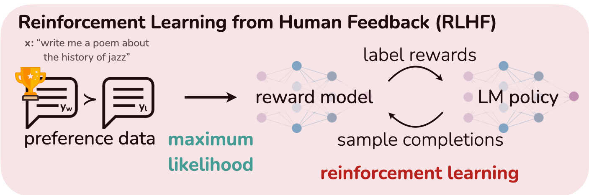
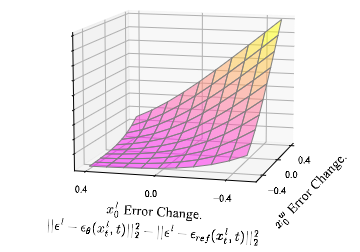
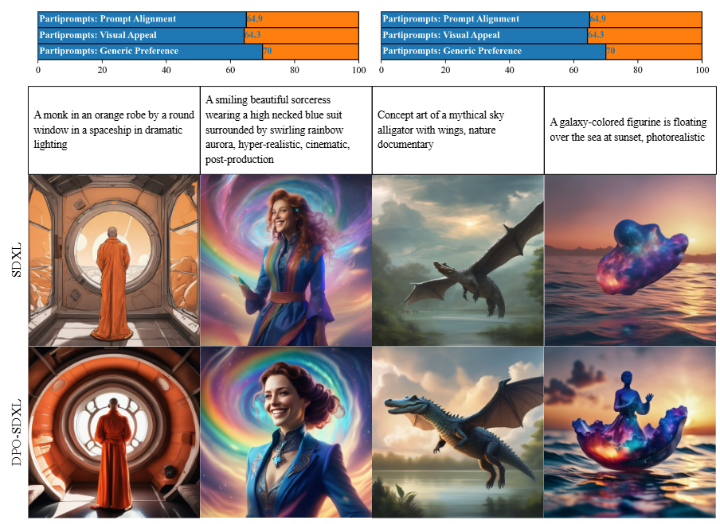

# Aligning Text to Image Models with Human Preferences Using Direct Preference Optimization

This presentation explores Direct Preference Optimization (DPO), a groundbreaking technique for aligning large-scale generative models with human preferences. We'll cover its theoretical foundations, its application to diffusion-based image models, and what the future holds for this powerful alignment method.
![[dpo_aligned.png]]

---

## 1. The AI Alignment Problem: Why Don't Models Just Work?

Large-scale models are trained on vast, unfiltered datasets from the internet. While this teaches them incredible world knowledge and generative capabilities, it doesn't inherently teach them what humans find helpful, safe, or high-quality. This is the **alignment problem**.

-   **For Language Models (LLMs):** Without alignment, models can produce responses that are unhelpful, factually incorrect, toxic, or simply fail to follow user instructions. They might imitate undesirable patterns seen in their training data.
-   **For Diffusion Models (Images):** Base models often struggle to precisely follow complex prompts, lack aesthetic appeal, or generate bizarre artifacts.

 

> **The Core Task:** How can we efficiently fine-tune these powerful pretrained models to align with our preferences?
>
> We formalize this using preference data: Given a prompt $x$, we collect data where humans have chosen a "winning" response $y_w$ over a "losing" response $y_l$.
> $$ (y_w \succ y_l \mid x) $$

Our goal is to use this data to steer the model's behavior.
![[Alignment.png]]

---

## 2. The "Old Way": Reinforcement Learning from Human Feedback (RLHF)

For years, the gold standard for alignment was **Reinforcement Learning from Human Feedback (RLHF)**. It's a powerful but complex multi-stage process.

#### The Three-Step RLHF Pipeline:

1.  **Supervised Fine-Tuning (SFT):** A pretrained model is fine-tuned on a small, high-quality dataset of prompt-response pairs. This adapts the model to the desired output format (e.g., chatbot-style conversation).
2.  **Reward Model (RM) Training:** A separate model is trained to predict which response a human would prefer. It takes the prompt $x$ and a response $y$ and outputs a scalar reward score, $r(x, y)$. This model is trained on the preference dataset $(y_w, y_l)$ using a loss that encourages $r(x, y_w) > r(x, y_l)$. The standard approach uses the Bradley-Terry model for pairwise preferences:
    $$ p(y_w \succ y_l | x) = \sigma(r(x,y_w) - r(x,y_l)) $$
    The reward model is trained by minimizing the negative log-likelihood of this preference data:
    $$ \mathcal{L}_{\text{RM}} = - \mathbb{E}_{(x, y_w, y_l) \sim \mathcal{D}} \left[ \log \sigma(r_\phi(x, y_w) - r_\phi(x, y_l)) \right] $$
3.  **RL Fine-Tuning (PPO):** The SFT model is further fine-tuned using the trained reward model as the reward function. An RL algorithm like Proximal Policy Optimization (PPO) is used to maximize the expected reward, with a KL-divergence penalty to prevent the model from straying too far from the original SFT model ($\pi_{\text{ref}}$).
    $$ \max_{\theta} \mathbb{E}_{y \sim \pi_\theta(y|x)} [r(x, y)] - \beta D_{KL}(\pi_\theta(y|x) \| \pi_{\text{ref}}(y|x)) $$

#### The Downsides of RLHF

While effective, RLHF is notoriously difficult to work with:
-   **Complex Pipeline:** Juggling multiple models (SFT, RM, policy, and value models for PPO) is a massive engineering challenge.
-   **Training Instability:** RL fine-tuning is sensitive to hyperparameters and can easily diverge.
-   **Resource Intensive:** Sampling from the large generative model during RL training is computationally expensive.

---

## 3. The Breakthrough: Direct Preference Optimization (DPO)

DPO simplifies the alignment process by getting rid of the explicit reward modeling and reinforcement learning steps. It directly optimizes the language model on preference data.

#### The Core Insight: Your Language Model is Secretly a Reward Model

The key insight from the DPO paper (Rafailov et al., 2024) is that the optimal solution to the KL-constrained RL objective has a special form:
$$ \pi_r(y|x) = \frac{1}{Z(x)} \pi_{\text{ref}}(y|x) \exp\left(\frac{1}{\beta} r(x,y)\right) $$
where $Z(x)$ is a partition function that normalizes the distribution.

This equation can be algebraically rearranged to define the optimal reward function $r(x,y)$ in terms of the optimal policy $\pi_r$ and the reference policy $\pi_{\text{ref}}$:
$$ r(x,y) = \beta \log\frac{\pi_r(y|x)}{\pi_{\text{ref}}(y|x)} + \beta \log Z(x) $$

#### From RL to a Simple Loss

When we substitute this reparameterized reward function back into the original reward model loss, the intractable partition function term $\beta \log Z(x)$ **cancels out perfectly** for the winning ($y_w$) and losing ($y_l$) pair.

This leaves us with a simple objective that depends only on the policy we are trying to train ($\pi_\theta$) and the reference policy ($\pi_{\text{ref}}$):

$$
\mathcal{L}_{\text{DPO}}(\pi_{\theta}; \pi_{\text{ref}}) = -\mathbb{E}_{(x, y_w, y_l)\sim \mathcal{D}} \left[\log \sigma \left(\beta \log \frac{\pi_{\theta}(y_w\mid x)}{\pi_{\text{ref}}(y_w\mid x)} - \beta \log \frac{\pi_{\theta}(y_l\mid x)}{\pi_{\text{ref}}(y_l\mid x)}\right)\right]
$$

This is a simple binary cross-entropy loss! We are directly optimizing the language model to satisfy the preferences. The term inside the sigmoid acts as an implicit reward: we want the log-probability ratio to be higher for the winning response than for the losing one.

#### Why It's Better

-   **Simple:** No separate reward model training. No complex RL pipeline. It's just a new loss function.
-   **Stable:** Far more stable than PPO, as it avoids the instabilities of reinforcement learning.
-   **Efficient:** Computationally lightweight. It doesn't require sampling from the model during training.

---

## 5. Expanding the Horizon: DPO for Diffusion Models

The success of DPO on LLMs raised a question: can this principle be applied to other generative domains like image generation? The answer is yes, but it required a clever adaptation.

#### The Challenge: Intractable Likelihood

The DPO loss function relies on the model's likelihood, $\pi_\theta(y|x)$. For LLMs (autoregressive models), this is easy to compute. For diffusion models, the likelihood $p_\theta(x_0|c)$ is intractable to compute directly.

#### The Solution: Diffusion-DPO

The Diffusion-DPO paper (Wallace et al., 2023) solves this by using the **Evidence Lower Bound (ELBO)**, a well-known proxy for the log-likelihood in variational inference. By substituting the ELBO for the log-likelihood and making several simplifying assumptions, they derive a new loss function for diffusion models.

The final Diffusion-DPO loss is an upper bound on the original DPO objective. Instead of working with probabilities, it works with the model's predicted **denoising errors**:

$$
\mathcal{L}_{\text{D-DPO}} \propto - \mathbb{E} \left[ \log\sigma \left( \beta' \left( (\epsilon_{\text{diff}}^l)^2 - (\epsilon_{\text{diff}}^w)^2 \right) \right) \right]
$$

where
-   $\epsilon_{\text{diff}}^w = \| \epsilon^w - \epsilon_\theta(x_t^w, t, c) \|^2 - \| \epsilon^w - \epsilon_{\text{ref}}(x_t^w, t, c) \|^2$
-   $\epsilon_{\text{diff}}^l = \| \epsilon^l - \epsilon_\theta(x_t^l, t, c) \|^2 - \| \epsilon^l - \epsilon_{\text{ref}}(x_t^l, t, c) \|^2$

In simple terms, the loss encourages the denoising error of the trained model $\epsilon_\theta$ (relative to the reference model $\epsilon_{\text{ref}}$) to be **smaller for the preferred image ($y_w$)** and **larger for the dispreferred image ($y_l$)**.

---

## 6. Diffusion-DPO in Action: Creating Better Images

Using the Pick-a-Pic dataset of over 850k human preferences, the authors fine-tuned the state-of-the-art Stable Diffusion XL (SDXL) model.

#### Performance

The Diffusion-DPO fine-tuned model **significantly outperformed** both the base SDXL model and the much larger SDXL model with its refiner module in human evaluations for both visual appeal and prompt alignment.

---

## 7. The Future is Aligned

DPO is more than just a single algorithm; it's a powerful and generalizable framework for aligning AI with human (or even AI-generated) preferences.

#### Key Takeaway

By recasting preference learning as a simple classification problem, DPO provides a **stable, efficient, and highly effective** alternative to complex RLHF pipelines, applicable across different model architectures and data modalities.

#### What's Next?

-   **Personalization:** Fine-tuning models to individual or group-specific preferences (e.g., a photographer's personal artistic style).
-   **Learning from AI Feedback (RLAIF):** Using a powerful existing model (like GPT-4 or Gemini) to generate preference labels at a massive scale, enabling even more powerful alignment.
-   **New Modalities:** Applying the DPO principle to other generative domains like **video, 3D models, and music generation**.

---

## 8. References & Further Reading

- Rafailov, R., Sharma, A., Mitchell, E., Ermon, S., Manning, C. D., & Finn, C. (2024). *Direct Preference Optimization: Your Language Model is Secretly a Reward Model*. arXiv preprint arXiv:2305.18290.
- Wallace, B., Dang, M., Rafailov, R., Zhou, L., Lou, A., Purushwalkam, S., Ermon, S., Xiong, C., Toyer, S., & Naik, N. (2023). *Diffusion Model Alignment Using Direct Preference Optimization*. arXiv preprint arXiv:2311.12908.
- Owen Oertell, Jonathan D. Chang, Yiyi Zhang, Kianté Brantley, & Wen Sun. (2024). RL for Consistency Models: Faster Reward Guided Text-to-Image Generation.
- Kevin Black, Michael Janner, Yilun Du, Ilya Kostrikov, & Sergey Levine. (2024). Training Diffusion Models with Reinforcement Learning.
- Yuval Kirstain, Adam Polyak, Uriel Singer, Shahbuland Matiana, Joe Penna, & Omer Levy. (2023). Pick-a-Pic: An Open Dataset of User Preferences for Text-to-Image Generation.

