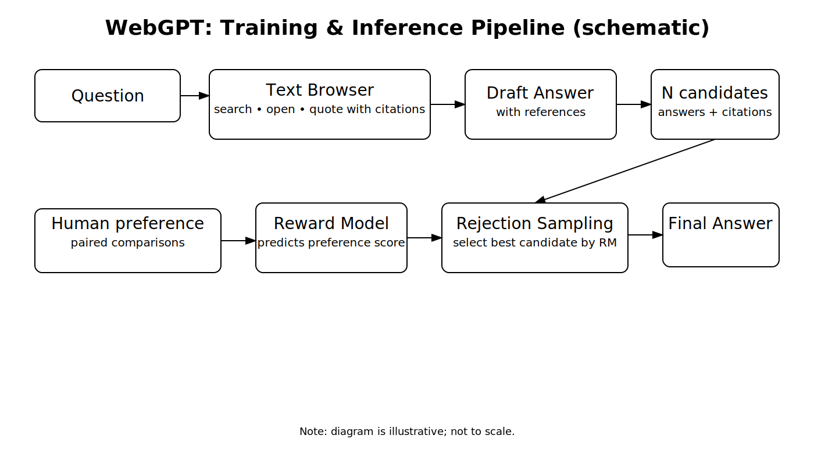
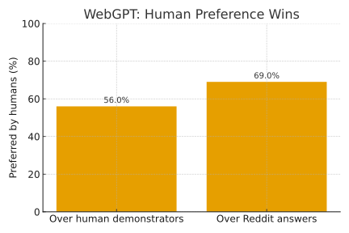
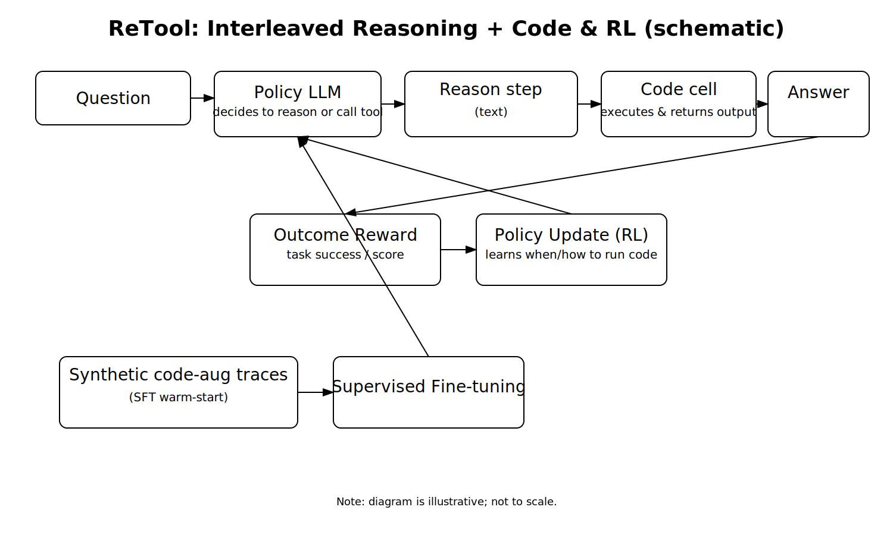
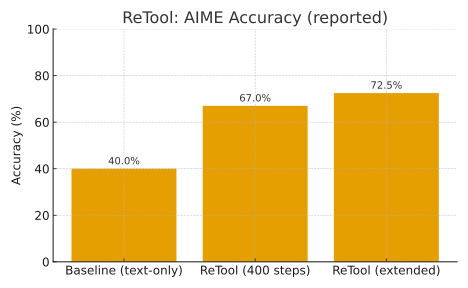

> TL;DR  
> LLMs can reason in plain text or call external tools. WebGPT uses human preference feedback with browsing and
> citations. ReTool uses outcome rewards with interleaved code execution. Preference signals help with factual
> presentation and style. Outcome rewards teach strategic tool use and step-wise correction.

## Motivation

Language models often face a choice. Continue reasoning in natural language, or call an external tool such as web search
or a code interpreter. In this post I compare two RL approaches that try to learn that choice: **WebGPT** and **ReTool**.

## WebGPT in one page

**What it does.** Answers long-form questions in a text-based browser with required citations. Trains a **reward model**
from human preference pairs, then fine-tunes the policy with PPO. At inference it generates multiple answers and keeps
the one that scores highest under the reward model using rejection sampling.

**Reported outcome on ELI5.** Human judges preferred WebGPT over **human demonstrators** 56% of the time and over **top
Reddit answers** 69% of the time. These are pairwise preference judgments, not strict accuracy.

## ReTool in one page

**What it does.** Interleaves language reasoning with **real-time code execution**. Uses **outcome-driven RL** so the
policy learns **when and how** to call tools. Code outputs feed back into reasoning, which supports self-correction.

**Reported outcome on AIME.** About **40%** for a text-only baseline. **67%** after about **400** RL steps. **72.5%** in
an extended setting.

## Broad comparisons

| Aspect                  | WebGPT                               | ReTool                                        |
|-------------------------|--------------------------------------|-----------------------------------------------|
| Primary training signal | Human preference reward model        | Task outcome reward with RL                   |
| Tool modality           | Web browsing with citations          | Code execution                                |
| When to use a tool      | Implicit via answer selection        | Explicit gating learned by the policy         |
| Credit assignment       | Answer-level, post hoc               | Step-level, interleaved                       |
| Typical wins            | Open-domain factual QA               | Math and algorithmic tasks, parsing           |
| Common failures         | Citation gaming and shallow browsing | Tool overuse and runtime errors               |
| Cost and latency        | Network latency and longer traces    | Extra compute for code, often slower than CoT |
| Evaluation exemplars    | ELI5 with human preference           | AIME or GSM-style with exact accuracy         |

This table condenses the poster comparison section. Choose the signal and the tool by task structure. Use browsing for
broad factual grounding with citations. Use code when exact computation and step-wise checking matter.

## Why the signals matter

- **Preference rewards** align style, clarity, and support from sources. They can nudge the model toward answers that
  readers like. They do not directly credit intermediate steps, so they can miss fine-grained improvements during
  reasoning.
- **Outcome rewards** credit success at the end of the trajectory and can be distributed across steps during RL. When
  the policy controls tool calls, the model can learn a gating rule that activates code only when it helps.

## Failure cases to watch

- **WebGPT** can browse shallowly or game citations.
- **ReTool** can overuse tools or hit runtime and sandbox errors.  
  Both add cost and latency compared with plain chain-of-thought. The choice should depend on the task and constraints.

## Acknowledgment

This post mirrors the content of my poster and the slide deck that I presented at the SUT Deep RL course poster session.
Figures and wording follow the poster so readers and viewers see the same story.

## References

[1] Nakano, R., et al. **WebGPT: Browser-Assisted Question-Answering with Human Feedback**. 2021.  
[2] Feng, J., et al. **ReTool: Reinforcement Learning for Strategic Tool Use in LLMs**. 2025.

> Notes  
> Figures show reported numbers from the papers. The pipeline diagrams are schematic and not to scale.