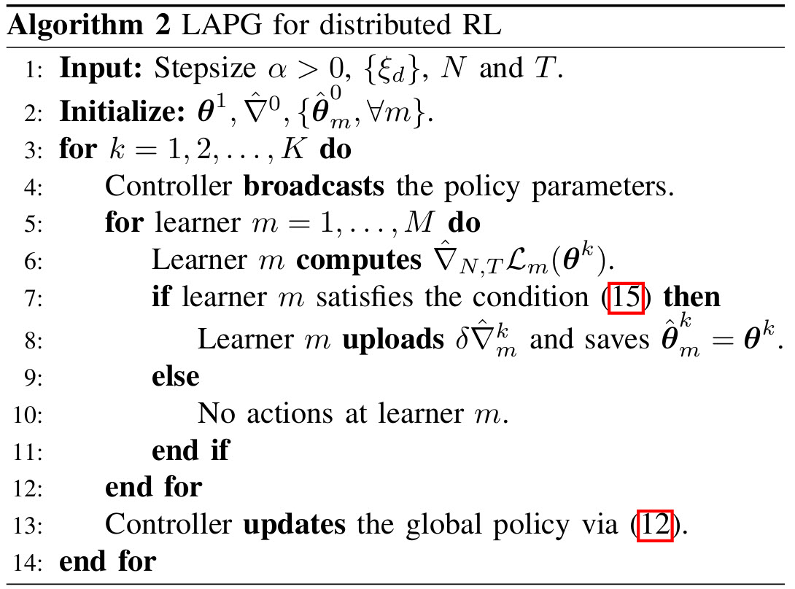

## Introduction

**Federated Reinforcement Learning (FRL)** is a framework that brings together the principles of **Federated Learning (FL)** and **Reinforcement Learning (RL)**. In this setup, multiple agents learn to optimize their policies in a distributed manner, while keeping their local data private. 

Unlike traditional RL, where an agent has centralized access to all data, FRL allows agents to train on their own environments independently and share only model updates or gradients. This approach enables collaborative learning across distributed agents without exposing raw data, effectively combining **RL’s decision-making capabilities** with **FL’s privacy-preserving distributed learning**.

---

## Federated Learning (FL) Basics

**Federated Learning (FL)** is a distributed machine learning approach where multiple clients (e.g., devices, organizations) collaboratively train a model **without sharing their raw data**. Instead of sending sensitive data to a central server, each client trains a local model on its own data and only sends model updates (such as gradients or weights) to a central aggregator. The aggregator combines these updates to improve a global model, which is then sent back to the clients for further training.

The key motivations behind FL are:  
- **Privacy preservation**: Sensitive data (like medical records or user behavior) never leaves the local device.  
- **Bandwidth efficiency**: Only model updates are communicated, reducing the need to transfer large datasets.  
- **Scalability**: FL allows training across many clients in parallel, enabling large-scale learning without centralizing all data.

**Applications of Federated Learning include:**  
- **Healthcare**: Hospitals can collaboratively train diagnostic models without sharing patient records.  
- **Mobile devices**: Smartphones can improve predictive keyboards or recommendation systems by training locally and sharing only updates, keeping personal data private.
---

## Why Federated Reinforcement Learning (FRL)?

While Federated Learning (FL) enables collaborative training of supervised models, many real-world applications require **decision-making in dynamic environments**, which is the domain of **Reinforcement Learning (RL)**. Traditional RL assumes a centralized agent with access to all interactions with the environment, which is often unrealistic when data is distributed across multiple clients or devices.  

**Federated Reinforcement Learning (FRL)** addresses this challenge by allowing multiple agents to learn collaboratively in a **distributed and privacy-preserving manner**. Each agent interacts with its local environment, collects experience, and updates its policy independently. These local updates are then shared (e.g., via model parameters or gradients) with a central aggregator or with other agents to improve a global or shared policy.  

FRL is motivated by several key challenges in distributed RL settings:  
- **Privacy concerns**: Sensitive environment data cannot be shared directly between agents or with a central server.  
- **Scalability**: Distributed agents can train in parallel, enabling learning across large-scale systems.  
- **Heterogeneous environments**: Agents may experience different local conditions or dynamics, making collaborative learning essential to generalize across environments.  
- **Reduced communication cost**: FRL sends **policy parameters instead of full trajectories**, saving bandwidth and reducing communication overhead.
---

## FRL Approaches
### Synchronous FRL

In **Synchronous Federated Reinforcement Learning**, all participating agents perform local updates on their policies and then **wait for every agent to finish** before the central aggregator combines their updates into a global policy. This approach ensures that all agents contribute equally to each global update, providing a consistent and stable learning process across the distributed system.  

In distributed reinforcement learning, frequent communication of policy gradients from all agents to a central server can be costly, especially in bandwidth-limited environments. To address this, the **Lazily Aggregated Policy Gradient (LAPG)** algorithm was proposed (Chen et al., *Communication-Efficient Policy Gradient Methods for Distributed Reinforcement Learning*).

**Key idea:** Instead of sending updates every round, each agent decides **adaptively whether to communicate its gradient** based on how much it has changed compared to the last communicated gradient. If the change is small, the agent skips communication, reducing unnecessary bandwidth usage.

**Highlights of LAPG:**
- **Adaptive communication:** Only send policy updates when necessary.  
- **Convergence guarantees:** Even with skipped rounds, LAPG maintains convergence rates similar to standard policy gradient methods under certain conditions.  

The algorithm above illustrates the LAPG idea: agents compute gradients locally, compare with previous updates, and only communicate to the server if the difference exceeds a threshold, effectively saving bandwidth while still improving the global policy.

While it tends to be more stable and easier to analyze, synchronous FRL can be slowed down by agents that are slower or have limited computational resources, since the global update cannot proceed until all agents have finished their local computations.

### Asynchronous FRL

In **Asynchronous Federated Reinforcement Learning**, unlike the synchronous approach, the central aggregator continuously listens for updates from agents. Whenever an agent finishes its local training, it immediately sends its policy updates, and the global parameters are updated accordingly.  

This allows agents to train and communicate independently, enabling more flexible and continuous learning across the distributed system.

The **AFedPG (Asynchronous Federated Policy Gradient)** algorithm extends federated reinforcement learning to an **asynchronous setting**, allowing agents to contribute updates independently without waiting for others.

**Server Side:**  
The central server continuously listens for incoming policy gradient updates from agents. When an update arrives, the server integrates it into the **global policy**. To account for the fact that different agents may compute updates based on slightly outdated policies, AFedPG employs a **lookahead term**: it adjusts the received gradient to anticipate the effect of any delays, helping maintain a stable and consistent global update.

**Agent Side:**  
Each agent interacts with its local environment and computes policy gradient updates based on its collected experience. Once an update is ready, the agent immediately sends it to the server. Agents do not wait for other agents, allowing them to train at their own pace.

---

## Comparison of Synchronous and Asynchronous FRL

Having introduced both **Synchronous** and **Asynchronous FRL** methods, it is instructive to compare their performance in distributed reinforcement learning tasks. The comparison highlights how each approach handles learning efficiency, communication, and policy improvement across multiple agents and environments.

**Sample Complexity Improvement**
In the experiments reported by the AFedPG paper, simulations were run on several Mujoco environments. The results show that **AFedPG achieves higher cumulative rewards as the number of agents increases** (N = 1, 2, 4, 8).  

This indicates an improvement in **sample efficiency**: with more agents contributing updates asynchronously, the global policy learns faster and achieves better performance, effectively improving sample complexity.

**Time Complexity Improvement**
Different methods—**AFedPG**, **FedPG**, **Vanilla PG** (without the lookahead term), and **A3C**—can be compared by looking at cumulative rewards over time. **AFedPG consistently reaches higher rewards faster** than the other approaches across Mujoco environments.

The **lookahead term** in AFedPG allows the server to account for delayed updates from agents, making the global policy updates more effective. This adjustment is a key reason behind AFedPG’s superior performance compared to methods without it.

---

## Conclusion

Federated Reinforcement Learning (FRL) provides a framework for multiple agents to learn collaboratively in a distributed, privacy-preserving manner. By combining the principles of Federated Learning and Reinforcement Learning, FRL enables agents to optimize policies without sharing raw data, making it suitable for applications in healthcare, edge computing, and other distributed systems.

Two main approaches—**Synchronous** and **Asynchronous FRL**—offer different trade-offs in training dynamics. Synchronous FRL ensures consistent updates but requires agents to wait for each other, while Asynchronous FRL allows agents to contribute updates independently, enabling faster and more flexible learning. Algorithms like **LAPG** and **AFedPG** demonstrate how communication-efficient and asynchronous policy gradient methods can improve both sample and time efficiency, with mechanisms like gradient skipping and lookahead adjustments further enhancing performance.

Overall, FRL is a promising direction for scalable, distributed reinforcement learning, providing a balance between efficient learning, privacy, and real-world applicability.

---
## Future Work Directions

There are several promising directions for future research in FRL:  

- **Robustness to adversarial agents:** Investigating methods to defend against malicious or adversarial workers in asynchronous setups.  
- **Improved communication efficiency:** Studying the compatibility of asynchronous FRL with techniques like local updates, quantization, and low-rank decomposition to reduce communication costs in deep RL.  
- **Advanced policy optimization:** Extending second-order policy gradient methods, such as natural policy gradients, to asynchronous federated settings to achieve better sample efficiency.  

---
## References

- **LAPG (Lazily Aggregated Policy Gradient):**  
  - Chen, T., Zhang, K., Giannakis, G.B., Ba¸sar, T. (2022). "Communication-Efficient Policy Gradient Methods for Distributed Reinforcement Learning." *IEEE Transactions on Control of Network Systems*, 9(2), 917–929. [DOI](https://doi.org/10.1109/TCNS.2021.3078100)

- **AFedPG (Asynchronous Federated Policy Gradient):**  
  - Lan, G., Han, D.-J., Hashemi, A., Aggarwal, V., Brinton, C.G. (2025). "Asynchronous Federated Reinforcement Learning with Policy Gradient Updates: Algorithm Design and Convergence Analysis." *arXiv:2404.08003*. [Paper](https://arxiv.org/abs/2404.08003)

