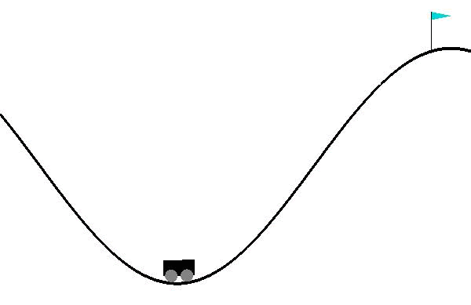

# Hierarchical Reinforcement Learning: From Options to Goal-Conditioned Policies

## Introduction and Motivation

In **Reinforcement Learning (RL)**, one of the most challenging questions is:
*How can we enable agents to learn complex, long-horizon behaviors that require sophisticated planning and coordination?*

Traditional flat RL approaches often struggle with tasks that naturally decompose into subtasks. Consider teaching an agent to navigate a multi-room building, play a strategic game, or perform complex manipulation tasks - these scenarios require **temporal abstraction** and **hierarchical thinking**.


**Hierarchical Reinforcement Learning (HRL)** addresses these fundamental challenges by organizing learning and decision-making into multiple levels of abstraction. Rather than learning a single monolithic policy, HRL enables agents to:

- **Decompose complex tasks** into manageable subtasks
- **Learn reusable skills** that transfer across different contexts  
- **Plan at multiple temporal scales** from primitive actions to high-level strategies
- **Achieve better sample efficiency** through structured exploration

The key insight is that many real-world tasks exhibit natural hierarchical structure. A cooking robot doesn't just select motor commands - it plans recipes, selects ingredients, and executes cooking procedures. Similarly, a game-playing agent doesn't just choose actions - it develops strategies, executes tactics, and adapts to opponents.

This hierarchical perspective transforms the fundamental RL question from "*What action should I take?*" to "*What skill should I execute, and how should I coordinate multiple skills over time?*"

In this comprehensive exploration, we examine the evolution of HRL from foundational frameworks to cutting-edge approaches, analyzing their theoretical foundations and practical applications.

## Background

Hierarchical Reinforcement Learning encompasses various approaches that introduce **temporal abstraction** and **structured policies** into the learning process. The fundamental motivation stems from limitations of flat RL:

**Challenges in Flat RL:**
- **Sparse rewards**: Long sequences of actions before receiving feedback
- **Large state-action spaces**: Exponential growth with task complexity  
- **Poor generalization**: Difficulty transferring knowledge across tasks
- **Exploration inefficiency**: Random exploration becomes impractical

**HRL Solutions:**
- **Temporal abstraction**: Actions that persist over multiple time steps
- **Skill decomposition**: Learning library of reusable behaviors
- **Hierarchical planning**: Decision-making at multiple levels
- **Structured exploration**: Guided by high-level objectives


The field has evolved through several paradigms, each addressing different aspects of hierarchical learning and control.

## Options Framework

The **Options Framework**, introduced by Sutton, Precup, and Singh (1999), provides the mathematical foundation for temporal abstraction in reinforcement learning. This seminal work established the theoretical groundwork for most subsequent HRL approaches.

### Mathematical Foundation

An **option** is formally defined as a triple $\mathcal{O} = \langle \mathcal{I}, \pi, \beta \rangle$:

- $\mathcal{I} \subseteq \mathcal{S}$: **Initiation set** - states where the option can be invoked
- $\beta: \mathcal{S} \rightarrow [0,1]$: **Termination function** - probability of option termination
- $\pi: \mathcal{S} \times \mathcal{A} \rightarrow [0,1]$: **Intra-option policy** - behavior while executing the option  


*The Options Framework extends MDPs with temporal abstractions, where higher-level policies select among options that execute for multiple time steps.*

### Semi-Markov Decision Process (SMDP)

Options transform the original MDP into a **Semi-Markov Decision Process** where decisions occur at option boundaries rather than individual time steps. The value function becomes:

$$Q_{\Omega}(s,o) = \sum_{k=1}^{\infty} \sum_{s'} P(s',k|s,o) \left[ \sum_{j=0}^{k-1} \gamma^j r_{t+j+1} + \gamma^k \max_{o'} Q_{\Omega}(s',o') \right]$$

where $P(s',k|s,o)$ represents the probability of reaching state $s'$ in exactly $k$ steps when executing option $o$ from state $s$.


### Learning with Options

**Intra-Option Learning**: Updates can occur during option execution, not just at termination:

$$Q_{\Omega}(s_t, o_t) \leftarrow Q_{\Omega}(s_t, o_t) + \alpha \left[ r_{t+1} + \gamma Q_{\Omega}(s_{t+1}, o_t) - Q_{\Omega}(s_t, o_t) \right]$$

This enables more efficient learning by utilizing all experience, similar to eligibility traces in temporal difference learning.


**Key Advantages:**
- **Theoretical foundation**: Mathematically grounded in SMDP theory
- **Temporal abstraction**: Natural handling of extended actions
- **Flexible termination**: Adaptive option duration based on state
- **Sample efficiency**: Intra-option learning utilizes all experience

The Options Framework has inspired numerous extensions and remains the theoretical backbone of modern HRL approaches.

## DIAYN: Diversity is All You Need

**DIAYN** (Diversity is All You Need), proposed by Eysenbach et al. (2018), revolutionized skill discovery by demonstrating that useful skills can emerge from a simple diversity objective without task-specific rewards.

### Core Insight

The fundamental idea is that **diverse and distinguishable skills** are inherently valuable. If an agent learns skills that:
1. **Visit different states** (diversity)
2. **Are predictable from states** (distinguishability)

Then these skills will likely be useful for downstream tasks.


*DIAYN learns diverse locomotive skills like running, jumping, and back-flips without any task-specific rewards.*

### Mathematical Framework

DIAYN maximizes mutual information between skills and states while encouraging action diversity:

$$\max_{\theta} I(S; Z) + H[A|S]$$

where:
- $I(S; Z)$ ensures states are predictable from skills (distinguishability)
- $H[A|S]$ encourages diverse actions (exploration)
- $Z$ represents discrete skill embeddings sampled from $p(z)$

### Implementation Details

**Discriminator Training**: A neural network $D_{\phi}(z|s)$ learns to predict skills from states:
$$\mathcal{L}\_{\text{disc}} = -\mathbb{E}\_{s \sim \rho\_{\pi}, z \sim p(z)}[\log D\_{\phi}(z|s)]$$

**Policy Training**: The policy receives pseudo-rewards from the discriminator:
$$r_{\text{DIAYN}}(s,a,z) = \log D_{\phi}(z|s) - \log p(z)$$

The complete objective becomes:
$$\mathcal{L}\_{\text{policy}} = \mathbb{E}\_{\pi}[r\_{\text{env}} + \lambda \cdot r\_{\text{DIAYN}}]$$


### Training Algorithm: DIAYN (Diversity is All You Need)

```pseudo
while not converged do
    Sample skill z ∼ p(z) and initial state s₀ ∼ p₀(s)
    for t ← 1 to steps_per_episode do
        Sample action a_t ∼ π_θ(a_t | s_t, z) from skill
        Step environment: s_{t+1} ∼ p(s_{t+1} | s_t, a_t)
        Compute q_φ(z | s_{t+1}) with discriminator
        Set skill reward r_t = log q_φ(z | s_{t+1}) − log p(z)
        Update policy (θ) to maximize r_t with SAC
        Update discriminator (φ) with SGD
```

**Key Benefits:**
- **Unsupervised discovery**: No task-specific rewards required
- **Emergent diversity**: Automatically learns varied behaviors
- **State coverage**: Skills naturally explore different regions
- **Transfer learning**: Skills fine-tune quickly for downstream tasks
- **Scalability**: Works in high-dimensional continuous control


<!-- |  |  |
|--------------|---------------|
|  |  |
|  |  |
 -->


DIAYN has spawned numerous follow-up works and remains one of the most influential approaches to unsupervised skill discovery.

## Goal-Conditioned Reinforcement Learning

**Goal-Conditioned RL** extends traditional RL by conditioning policies and value functions on desired goals, enabling agents to learn flexible behaviors that can achieve multiple objectives within a single framework.

### Universal Value Functions

The key innovation is learning **Universal Value Functions** (UVFs) that generalize across goals:

$$Q(s, a, g) = \mathbb{E}\left[\sum_{t=0}^{T} \gamma^t r(s_t, a_t, g) \Big| s_0=s, a_0=a, \text{goal}=g\right]$$

where $g$ represents the desired goal state or condition.


*Goal-conditioned policies take both state and goal as input, enabling multi-task learning within a single network.*

### Hindsight Experience Replay (HER)

**HER**, introduced by Andrychowicz et al. (2017), addresses the sparse reward problem by retrospectively relabeling experience with achieved goals:

**Core Idea**: Every failed trajectory succeeds at reaching the state it actually achieved.


### Goal Generation Strategies

**Curriculum Learning**: Goals can be generated to provide natural curriculum:

1. **Random goals**: Uniform sampling from goal space
2. **Achieved goals**: Goals from previously successful episodes  
3. **Frontier goals**: Goals at the boundary of achievable states
4. **Adversarial goals**: Goals designed to be challenging

### Multi-Goal Environments

Goal-conditioned RL excels in environments with:
- **Multiple valid objectives**: Navigation, manipulation, game objectives
- **Sparse rewards**: Binary success/failure signals
- **Compositional tasks**: Goals that can be decomposed into sub-goals


**Key Advantages:**
- **Sample efficiency**: Every trajectory provides multiple learning signals
- **Multi-task learning**: Single policy achieves many goals simultaneously  
- **Automatic curriculum**: HER provides natural progression from easy to hard
- **Zero-shot generalization**: Trained policy generalizes to new goals
- **Hierarchical extension**: Goals can represent high-level objectives

## Attribute Planner Model

The **Attribute Planner Model** represents a recent advancement in hierarchical RL that focuses on learning compositional representations where complex behaviors emerge from combining simpler attribute-based skills.

### Compositional Skill Representation

Rather than learning monolithic skills, the Attribute Planner decomposes behaviors into **interpretable attributes** that can be combined compositionally:

$$\text{skill}(s, g) = f(\text{attr}_1(s,g), \text{attr}_2(s,g), \ldots, \text{attr}_n(s,g))$$

where each $\text{attr}_i$ represents a specific aspect of behavior (e.g., speed, direction, height).


*The Attribute Planner learns to compose skills from interpretable attributes, enabling systematic exploration and transfer.*

### Planning in Attribute Space

**Attribute Encoder**: Maps states to semantic attribute representations:
$$\phi: \mathcal{S} \rightarrow \mathbb{R}^d$$

**Attribute Planner**: Plans sequences of attribute changes to achieve goals:
$$\text{plan}(s_{\text{current}}, s_{\text{goal}}) \rightarrow \\{a_1, a_2, \ldots, a_T\\}$$

**Skill Library**: Collection of parameterized skills indexed by attributes:
$$\\{\pi_{\theta}^{(i)}: \mathcal{S} \times \mathcal{A}\_{\text{attr}} \rightarrow \mathcal{A}\\}_{i=1}^N$$

### Learning Algorithm

- **Attribute Planner Training**


- **Attribute Planner Inference**


### Compositional Generalization

- **Combinatorial Composition of Skills:** The power lies in **compositional generalization**: $n$ primitive skills can compose into $2^n$ behaviors:

  - **Skill A**: Change object color
  - **Skill B**: Change object position  
  - **Skill A+B**: Change both color and position
  - **Novel Composition**: Skills learned independently compose automatically

- **Continuous Composition in Attribute Space (Systematic Exploration):** The attribute space provides structured exploration:

$$\mathcal{A}_{\text{explore}} = \\{\text{attr} : \text{attr} = \alpha \cdot \text{attr}_1 + (1-\alpha) \cdot \text{attr}_2\\}$$

This enables **interpolation** and **extrapolation** in attribute space to discover new behaviors.


**Key Advantages:**
- **Interpretability**: Attributes provide semantic meaning to learned skills
- **Compositional**: Combines basic attributes to create complex behaviors  
- **Systematic**: Structured exploration through attribute interpolation
- **Transferable**: Attributes generalize across different environments
- **Efficient**: Plans in lower-dimensional attribute space
- **Debuggable**: Easy to understand and modify learned behaviors

### Applications

The Attribute Planner excels in domains requiring:

- **Fine-grained control**: Robotics manipulation and locomotion
- **Interpretable behaviors**: Human-robot interaction scenarios
- **Systematic exploration**: Scientific discovery and optimization
- **Transfer learning**: Skills that generalize across task variations

## Conclusion and Future Work

### Analyzed Frameworks

| Framework | Type | Key Innovation | Theoretical Advantage |
|:---------:|:----:|:--------------:|:--------------------:|
| **Options Framework** | Temporal Abstraction | Semi-Markov Decision Process | Reduces temporal complexity |
| **DIAYN** | Skill Discovery | Information-theoretic diversity | Emergent skill acquisition |
| **Goal-Conditioned RL** | Spatial Abstraction | Universal Value Functions | Sample efficiency via relabeling |
| **Attribute Planner** | Compositional | Attribute-based planning | Combinatorial generalization |


### Conclusion

This theoretical analysis has examined four major paradigms in Hierarchical Reinforcement Learning, each addressing different aspects of the hierarchical learning problem. Based on our **Analyzed Frameworks** presented earlier, we can draw several key insights:

The **Options Framework** provides the foundational mathematical structure for temporal abstraction through Semi-Markov Decision Processes, offering significant theoretical advantages in reducing temporal complexity from $O(T)$ to $O(T/k)$. This approach excels in environments with long horizons and discrete action spaces but faces challenges in automatic option discovery.

**DIAYN** revolutionizes skill discovery through its information-theoretic approach, maximizing mutual information $I(S;Z)$ between skills and states. While it guarantees skill diversity and enables emergent behavior discovery without reward engineering, it faces scalability limitations as the discriminator complexity grows with the number of skills.

**Goal-Conditioned RL** addresses spatial abstraction through Universal Value Functions, providing exceptional sample efficiency improvements via Hindsight Experience Replay. The theoretical reduction from $O(\frac{1}{\epsilon})$ to $O(\frac{1}{\sqrt{\epsilon}})$ sample complexity makes it particularly powerful for sparse reward environments, though it requires structured goal spaces for effective generalization.

The **Attribute Planner** offers perhaps the most promising approach for compositional generalization, enabling exponential scaling where $n$ primitive skills can compose into $2^n$ behaviors. Its attribute-based representation provides both interpretability and systematic exploration, though it relies on effective attribute discovery mechanisms.

Each framework represents a fundamental trade-off: the Options Framework prioritizes temporal efficiency, DIAYN emphasizes unsupervised skill emergence, Goal-Conditioned RL focuses on sample efficiency, and the Attribute Planner maximizes compositional power. The choice between these approaches should be guided by the specific characteristics of the target domain, available computational resources, and desired properties of the learned behaviors.

### Current Limitations

**Credit Assignment**: Hierarchical credit assignment remains challenging, particularly in deep option hierarchies where the relationship between high-level decisions and low-level outcomes becomes complex.

**Non-Stationarity**: As lower-level policies change during learning, higher-level policies face non-stationary transition dynamics, which can destabilize hierarchical learning.

**Scalability**: Current methods often struggle with very deep hierarchies (>3 levels), as the complexity of coordination grows exponentially.

**Environment Dependency**: The effectiveness of different HRL approaches varies significantly across domains, making method selection non-trivial.

### Future Research Directions

- **1. Meta-Hierarchical Learning:** Developing methods that automatically determine the appropriate hierarchical structure for a given task:

```python
def meta_hierarchical_learning():
    # Learn to learn hierarchical structures
    for task_distribution in meta_tasks:
        optimal_hierarchy = structure_search(task_distribution)
        adapt_hierarchy(optimal_hierarchy)
        performance = evaluate_on_new_tasks()
        update_structure_prior(performance)
```

- **2. Language-Grounded Hierarchical RL:** Integrating natural language understanding with hierarchical policies:

  - **Language-conditioned options**: $\pi(a|s,l,z)$ where $l$ represents language instructions
  - **Compositional skill combination**: Using language to compose and modify learned skills
  - **Interactive learning**: Learning hierarchies through human feedback and demonstration

- **3. Causal Hierarchical RL:** Incorporating causal reasoning into hierarchical decision making:

$$\text{do}(\text{skill}_i) \rightarrow \mathbb{E}[\text{outcome}|\text{context}]$$

This enables counterfactual reasoning about skill selection and improved transfer learning.

- **4. Multi-Agent Hierarchical Coordination:** Extending HRL to multi-agent settings where agents must coordinate their hierarchical policies:

  - **Hierarchical communication protocols**
  - **Distributed skill libraries** 
  - **Emergent team strategies**

- **5. Continual Hierarchical Learning:** Developing methods that can continuously acquire new skills while preserving existing knowledge:

  - **Hierarchical memory architectures**
  - **Skill modularity and composition**
  - **Catastrophic forgetting prevention**

### Open Challenges

Several fundamental questions remain open in hierarchical reinforcement learning:

**Automatic Hierarchy Discovery**: How can we automatically discover the optimal hierarchical decomposition for a given task or domain?

**Theoretical Guarantees**: What are the theoretical limits and convergence guarantees for different hierarchical learning approaches?

**Robust Credit Assignment**: How can we develop more robust methods for assigning credit across temporal and hierarchical boundaries?

**Real-World Deployment**: How can we ensure learned hierarchical policies remain robust and interpretable in real-world deployment scenarios?

### Practical Applications

The advances in HRL have significant implications for real-world applications:

**Robotics**: Hierarchical policies enable robots to perform complex manipulation tasks by composing learned skills. For example, a cooking robot can combine skills for ingredient preparation, cooking procedures, and plating techniques.

**Autonomous Vehicles**: Self-driving cars can benefit from hierarchical decision-making that operates at multiple temporal scales, from millisecond-level control to route-level planning.

**Game Playing**: Strategic games require hierarchical thinking, from immediate tactical decisions to long-term strategic planning. HRL provides natural frameworks for such multi-scale decision making.

**Scientific Discovery**: Hierarchical exploration strategies can accelerate scientific discovery by systematically exploring hypothesis spaces at multiple levels of granularity.

The field of Hierarchical Reinforcement Learning continues to evolve rapidly, with new approaches addressing fundamental challenges in temporal abstraction, skill discovery, and multi-task learning. As these methods mature, we expect to see increased adoption in complex real-world applications where traditional flat RL approaches fall short.

## References

- **Foundational Papers**

1. Sutton, R. S., Precup, D., & Singh, S. (1999). Between MDPs and semi-MDPs: A framework for temporal abstraction in reinforcement learning. *Artificial Intelligence*, 112(1-2), 181-211. [Paper](https://www.sciencedirect.com/science/article/pii/S0004370299000521)

2. Dayan, P., & Hinton, G. E. (1993). Feudal reinforcement learning. *Advances in Neural Information Processing Systems*, 5. [Paper](https://proceedings.neurips.cc/paper/1992/file/d14220ee66aeec73c49038385428ec4c-Paper.pdf)

- **Skill Discovery**

3. Eysenbach, B., Gupta, A., Ibarz, J., & Levine, S. (2018). Diversity is all you need: Learning skills without a reward function. *International Conference on Learning Representations*. [Paper](https://arxiv.org/abs/1802.06070)

4. Sharma, A., Gu, S., Levine, S., Kumar, V., & Hausman, K. (2019). Dynamics-aware unsupervised discovery of skills. *International Conference on Learning Representations*. [Paper](https://arxiv.org/abs/1907.01657)

- **Goal-Conditioned Learning**

5. Chane-Sane, E., Schmid, C., & Laptev, I. (2021). Goal-Conditioned Reinforcement Learning with Imagined Subgoals. *arXiv preprint arXiv:2107.00541*. [Paper](https://arxiv.org/abs/2107.00541)


6. Andrychowicz, M., Wolski, F., Ray, A., Schneider, J., Fong, R., Welinder, P., ... & Zaremba, W. (2017). Hindsight experience replay. *Advances in Neural Information Processing Systems*, 30. [Paper](https://arxiv.org/abs/1707.01495)

- **Attribute Planner Models**

7. Zhang, A., Lerer, A., Sukhbaatar, S., Fergus, R., & Szlam, A. (2019). Composable Planning with Attributes. *arXiv preprint arXiv:1803.00512*. [Paper](https://arxiv.org/abs/1803.00512)

8. Chang, M., Dayan, A. L., Meier, F., Griffiths, T. L., Levine, S., & Zhang, A. (2023). Neural Constraint Satisfaction: Hierarchical Abstraction for Combinatorial Generalization in Object Rearrangement. *arXiv preprint arXiv:2303.11373*. [Paper](https://arxiv.org/abs/2303.11373)

- **Modern Hierarchical Methods**

9. Vezhnevets, A. S., Osindero, S., Schaul, T., Heess, N., Jaderberg, M., Silver, D., & Kavukcuoglu, K. (2017). FeUdal networks for hierarchical reinforcement learning. *International Conference on Machine Learning*. [Paper](https://arxiv.org/abs/1703.01161)

10. Nachum, O., Gu, S., Lee, H., & Levine, S. (2018). Data-efficient hierarchical reinforcement learning. *Advances in Neural Information Processing Systems*, 31. [Paper](https://arxiv.org/abs/1805.08296)

11. Deschenaux, J., Krawczuk, I., Chrysos, G., & Cevher, V. (2024). Going beyond Compositions, DDPMs Can Produce Zero-Shot Interpolations. *arXiv preprint arXiv:2405.19201*. [Paper](https://arxiv.org/abs/2405.19201)


- **Surveys and Theoretical Foundations**

12. Hutsebaut-Buysse, M., Mets, K., & Latré, S (2022). Hierarchical Reinforcement Learning: A Survey and Open Research Challenges. *Machine Learning and Knowledge Extraction, 4*(1), 172–221. [Paper](https://www.mdpi.com/2504-4990/4/1/9)


13. Ladosz, P., Weng, L., Kim, M., & Oh, H. (2022). Exploration in Deep Reinforcement Learning: A Survey. *arXiv preprint arXiv:2205.00824*. [Paper](https://arxiv.org/abs/2205.00824)

14. Pateria, S., Subagdja, B., Tan, A. H., & Quek, C. (2021). Hierarchical reinforcement learning: A comprehensive survey. *ACM Computing Surveys*, 54(5), 1-35. [Paper](https://dl.acm.org/doi/10.1145/3453160)

15. Barto, A. G., & Mahadevan, S. (2003). Recent advances in hierarchical reinforcement learning. *Discrete Event Dynamic Systems*, 13(1-2), 41-77. [Paper](https://link.springer.com/article/10.1023/A:1022140919877)


- **Additional Resources:**
  - [OpenAI Baselines HER Implementation](https://github.com/openai/baselines/tree/master/baselines/her)
  - [DIAYN Implementation](https://github.com/ben-eysenbach/sac)
  - [Learning Diverse Skills without a Reward Function](https://sites.google.com/view/diayn/)
  - [Hierarchical RL Tutorial](https://thegradient.pub/the-promise-of-hierarchical-reinforcement-learning/)