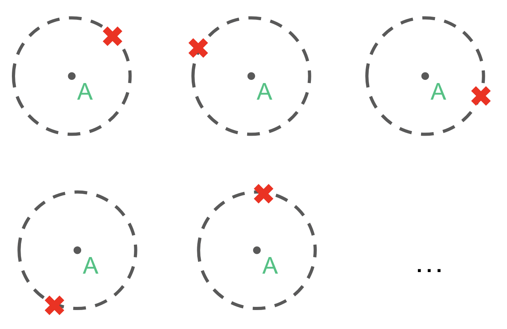
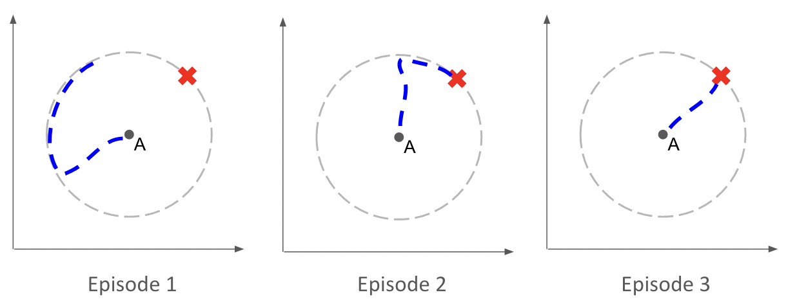
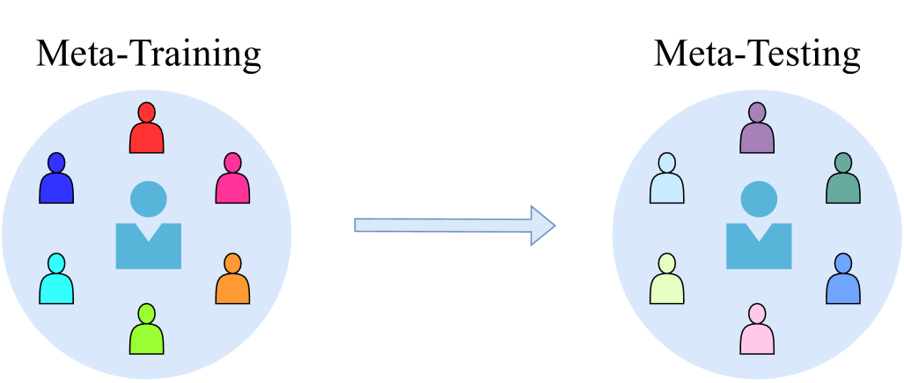
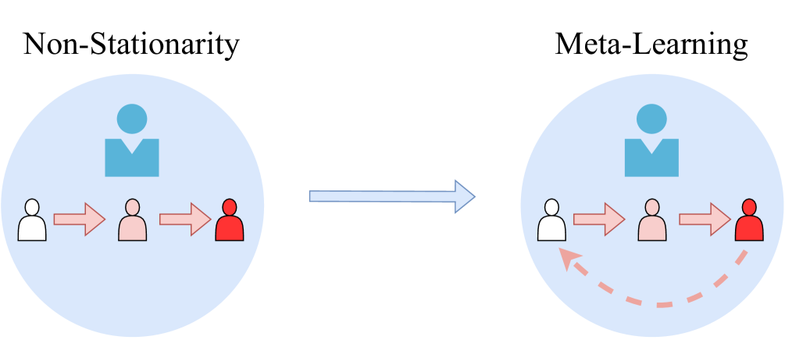
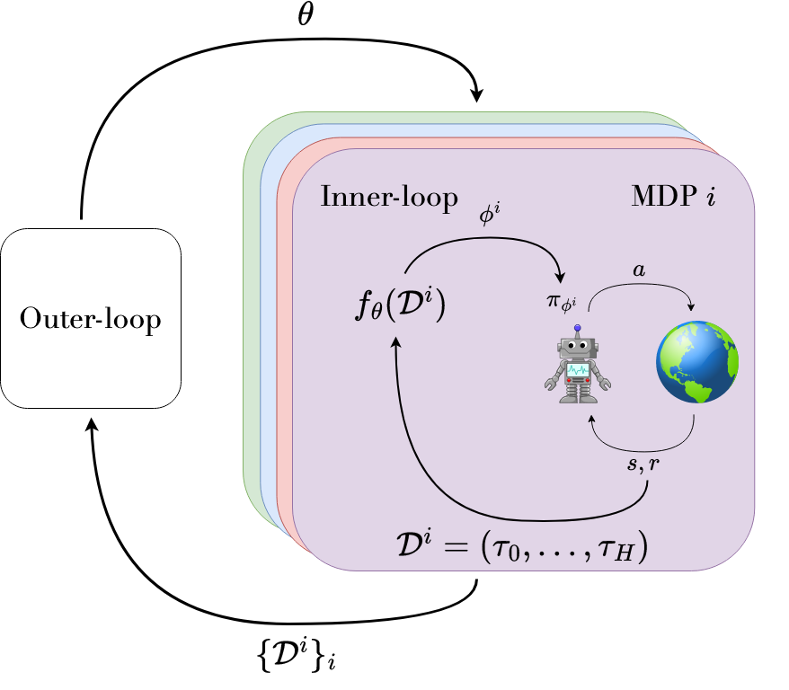
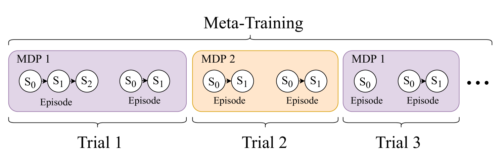

# Meta-Reinforcement Learning: An Introduction

## Abstract

Deep reinforcement learning (RL) has achieved remarkable successes, including game-playing, robotic control, and navigation tasks. Yet, its limited data efficiency and lack of generality restrict wider applicability. **Meta-Reinforcement Learning (Meta-RL)** seeks to address these shortcomings by treating the design of RL algorithms themselves as a machine learning problem. The central aim is to develop policies that adapt rapidly to new tasks drawn from a distribution, using as little data as possible.  

This article introduces the Meta-RL problem setting and its major variations, highlighting key motivations, trade-offs, and illustrative examples. The discussion emphasizes how Meta-RL can improve adaptation, surveys common formulations such as few-shot learning, and outlines future directions toward practical deployment.

---

## Introduction

**Meta-RL** belongs to the broader family of **meta-learning** methods—approaches that “learn to learn.” In Meta-RL, the object of learning is an RL algorithm (or components of it). The goal is to leverage sample-inefficient training across tasks to produce **sample-efficient adaptation** at deployment time.  

Historically, ideas resembling Meta-RL have appeared in machine learning research for decades, and analogues have even been observed in neuroscience. Today, the renewed interest comes from the practical limitations of conventional RL: while powerful, current algorithms demand massive amounts of interaction data, making them impractical for many real-world problems.

---

### Motivation

Despite success stories such as mastering Go, controlling high-altitude balloons, and enabling locomotion in rough terrain, RL still struggles with **sample inefficiency**. Training often requires millions of interactions, which is infeasible when data collection is slow, expensive, or unsafe.  

Meta-RL addresses this by **producing algorithms that adapt faster** than human-designed RL methods. By learning from a distribution of tasks, an agent can reuse past experience and adapt efficiently when confronted with a novel task.

---

### Trade-offs

The promise of improved adaptation comes with two challenges:

1. **Data demands during training** — learning an entire algorithm requires more data than standard RL.  
2. **Reduced generality** — meta-training on a narrow distribution may limit generalization to new, unseen environments.  

Meta-RL therefore exchanges higher upfront cost for **faster adaptation at test time**.

---

### Example: A Robotic Chef

A conceptual example illustrates the idea. Suppose a **robot chef** is deployed into different households. Each kitchen varies in layout, appliances, and storage. Training a new policy from scratch in every kitchen would be inefficient and potentially unsafe. Training in a single kitchen and fine-tuning is also insufficient, as it fails to capture the diversity of environments.  

Instead, Meta-RL trains the robot on a **distribution of kitchens**, enabling it to adapt rapidly to new layouts. The robot not only makes better use of collected data but also explores more intelligently—for instance, checking likely cabinet locations rather than searching randomly. This upfront meta-training investment allows efficient adaptation in deployment, especially in safety-critical domains.

---

### Scope

This article focuses on Meta-RL in the context of machine learning, leaving aside related work in neuroscience. The emphasis is on research developed over the past several years, primarily presented at leading conferences such as NeurIPS, ICML, and ICLR, while also considering relevant contributions from other venues. The aim is not exhaustive coverage but rather a clear overview of the most salient concepts, algorithms, and applications.

---

### Overview

We first define Meta-RL and introduce key problem settings, with illustrative examples and baseline algorithms. The discussion then turns to the most widely studied formulation, **few-shot Meta-RL**, where agents must adapt to a new task in only a handful of episodes.  

**(a) Meta-training tasks**  

**(b) Rollout at meta-test time**  

*An agent meta-trained to navigate toward goals on a unit circle (a) can, at test time, adapt within a few episodes to new goal positions (b). In contrast, a standard RL agent would require hundreds of thousands of interactions when trained from scratch.*

---

## Applications of Meta-Reinforcement Learning

In many domains, fast adaptation to unseen situations during deployment is critical. Meta-RL provides a promising solution by meta-training on a set of related tasks and then adapting quickly during deployment.  

Examples of application areas include:  
- **Traffic signal control** [zang2020metalight]  
- **Building energy control** [luna2020information, grewal2021variance]  
- **Automatic code grading in education** [liu2022giving]  

Meta-RL has also been used as a **subroutine** to address non-stationarity in continual RL [al2018continuous, nagabandi2018deep, riemer2018learning, berseth2021comps, liotet2022lifelong, woo2022structure].  
Furthermore, curriculum learning and unsupervised environment design (UED) have been used to construct task distributions for meta-RL agents [mehta2020curriculum, dennis2020emergent].

This section discusses where meta-RL has been most widely applied, with emphasis on **robotics** and **multi-agent RL**.

---

### Robotics

Robotics is a natural application domain for meta-RL, as robots must adapt to new tasks and environmental conditions at deployment. Examples include manipulating objects of different shapes, or locomotion under different terrain conditions.  

Training a robot from scratch for each possible task is often infeasible: RL training requires millions of steps, and collecting such data in the real world is time-consuming, expensive, and potentially dangerous. Meta-RL addresses this by **meta-learning inductive biases from related tasks** that support fast adaptation to unseen tasks.

#### Simulation vs Real-World Meta-Training

- **Simulation-based meta-training**: Most methods train in simulation, varying environment parameters to create tasks, then deploy the meta-trained policy in the real world. This sim-to-real transfer [zhao2020sim] is widely used [yu2017preparing, akkaya2019solving, arndt2020meta, cong2020self, kaushik2020fast, schoettler2020meta, schwartzwald2020sim, song2020rapidly, yu2020learning, ghadirzadeh2021bayesian, kumar2021error, kumar2021rma, he2022learning].  
- **Real-world meta-training**: Some works train directly in the real world [nagabandi2019learning, belkhale2021model, zhao2021meld, zhao2022offline, walke2022dont]. A few even learn to reset tasks autonomously [walke2022dont].

#### Model-Free Meta-RL in Robotics

Model-free methods adapt the control policy directly at deployment. Applications include:  
- **Locomotion** of legged robots with different dynamics (mass, motor voltages, terrain) [yu2017preparing, schwartzwald2020sim, yu2020learning, song2020rapidly, kumar2021error, kumar2021rma]  
- **Manipulation** with different arms or objects [yu2017preparing, akkaya2019solving, arndt2020meta, schoettler2020meta, ghadirzadeh2021bayesian, zhao2022offline]  

Approaches:  
- **Black-box methods** [akkaya2019solving, schwartzwald2020sim]: policy is conditioned on history via RNNs or similar.  
- **Task-inference methods** [yu2017preparing, schoettler2020meta, yu2020learning, kumar2021error, kumar2021rma, he2022learning, zhao2022offline]: policy is conditioned on an inferred context vector.  
- **Parameterized policy gradient (PPG) methods** [gao2019fast, arndt2020meta, song2020rapidly, ghadirzadeh2021bayesian]: typically based on MAML. These usually require more rollouts per task but provide structured adaptation.

#### Model-Based Meta-RL in Robotics

Model-based approaches adapt the **dynamics model** rather than the control policy. This can be more efficient, since dynamics changes (e.g., mass, friction) may be easier to capture.  

Examples:  
- **Black-box model-based** [nagabandi2019learning, cong2020self, belkhale2021model]  
- **PPG-style model-based** [nagabandi2019learning, kaushik2020fast, anne2021meta]  

Model-based methods often provide higher sample efficiency and robustness, making them attractive for robotics where data is costly.

---

### Multi-Agent Reinforcement Learning

Meta-RL has been applied in **multi-agent RL (MARL)** to address challenges such as generalization across agents and handling non-stationarity.

#### Generalization Over Other Agents

In MARL, agents interact in a shared environment. Other agents’ policies can vary widely (opponents, teammates, or even humans). This creates a **generalization problem**: an agent must adapt to unseen partners or adversaries.  

Meta-RL addresses this by treating other agents as part of the task distribution. By meta-training over diverse partners/opponents, an agent can adapt at meta-test time to new ones.  

**Figure.** Meta-RL for generalization over unseen agents. The agent is trained to adapt quickly to new teammates or opponents.

#### Non-Stationarity

From the perspective of one agent, the environment is non-stationary because other agents are also learning. Their policies change during training, making the environment itself non-stationary.  

Meta-RL addresses this by treating *the learning of other agents* as part of the task. Resetting other agents during meta-training yields a stationary distribution over tasks, allowing meta-RL to train robust adaptation mechanisms.  

**Figure.** Meta-RL for handling non-stationarity: other agents’ learning processes are included in the task distribution.

#### Meta-RL Methods in MARL

- **Parameterized policy gradient (PPG)**: applied to non-stationarity [al2018continuous, foerster2018learning, kim2021policy], opponent curricula [gupta2021dynamic, feng2021neural], learning reward functions [yang2022adaptive], and communication topologies [yang2022adaptive].  
- **Black box methods**: for generalization to teammates [charakorn2021learning] and opponents [lu2022model].  
- **Task-inference methods**: for generalization to teammates [grover2018learning, zintgraf2021deep], opponents [grover2018learning, papoudakis2020variational, zintgraf2021deep], and humans [he2022learning].  
- **Non-adaptive baselines**: for cheap talk [lu2022adversarial] or Stackelberg equilibria [gerstgrasser2022metarl].

#### Meta-RL Objective in MARL

When other agents are considered part of the task, the meta-RL objective can be expressed as:

$$
\mathcal{J}(\theta) =
\mathbb{E}_{\pi'_i \sim p(\pi'_i), \; \forall i=0 \ldots A}
\left[
    \mathbb{E}_{\mathcal{D}}
    \left[
        \sum_{\tau \in \mathcal{D}_{K:H}} G(\tau)
        \;\Big|\; f_\theta, \pi'_0, \ldots, \pi'_A
    \right]
\right],
$$

where  
- $A$ is the number of other agents,  
- $\pi'_i$ denotes their policies,  
- $\mathcal{D}_{K:H}$ is the meta-trajectory from shot $K$ to horizon $H$,  
- $G(\tau)$ is the discounted return.

---

## Defining Meta-Reinforcement Learning

### Core Idea

Traditionally, RL algorithms are designed, engineered, and tested by humans.  
The idea of **Meta-RL** is instead to learn (parts of) an RL algorithm $f$ using machine learning.  

- In standard RL, we learn a policy $\pi$.  
- In Meta-RL, we learn an **algorithm** $f$ that outputs the policy.  

This does not remove all human effort but shifts it: from directly designing algorithms to specifying the training environments and parameterizations that enable learning in a data-driven way.

---

### Inner-Loop and Outer-Loop

Meta-RL has a **bi-level structure**:

- **Outer-loop (meta-training):** the algorithm that learns $f$.  
- **Inner-loop (adaptation):** the learned $f$, which produces policy parameters $\phi$ given data.  

During **meta-testing**, we evaluate the inner-loop’s ability to adapt quickly to a new task (MDP).  
The outer-loop requires access to tasks sampled from a distribution $p(\mathcal{M})$.

**Figure.** Inner- and outer-loop interaction:  
- The policy $\pi_\phi$ interacts with tasks (MDPs), producing trajectories $\tau$.  
- The resulting data from a trial forms a **meta-trajectory** $\mathcal{D}$.  
- The inner-loop $f_\theta$ maps $\mathcal{D}$ to adapted parameters $\phi$.  
- The outer-loop updates meta-parameters $\theta$ using all collected meta-trajectories.

---

### Parameterization

The inner-loop is generally parameterized as $f_\theta$ with meta-parameters $\theta$.  
It maps a meta-trajectory $\mathcal{D}$ to adapted parameters $\phi$:

$
\phi = f_\theta(\mathcal{D})
$

- The policy $\pi_\phi$ is called the **base policy**.  
- Some parameters are adapted within the inner-loop (task-specific), while others remain meta-parameters updated in the outer-loop.  
- $\mathcal{D}$ may contain multiple episodes, indexed as $\mathcal{D}_i$ if needed.  

Different algorithms apply $f_\theta$ at different granularities: step-level or episode-level.

---

### Meta-RL Objective

In Meta-RL, the objective is defined over task distributions and meta-trajectories:

$
\mathcal{J}(\theta) =
\mathbb{E}_{\mathcal{M}_i \sim p(\mathcal{M})}
\Big[
    \mathbb{E}_{\mathcal{D}}
    \big[
        \sum_{\tau \in \mathcal{D}_{K:H}} G(\tau) \,\big|\, f_\theta, \mathcal{M}_i
    \big]
\Big],
$

where:

- $G(\tau) = \sum_{t=0}^T \gamma^t r_t$ is the discounted return along trajectory $\tau$ in task $\mathcal{M}_i$,  
- $H$ is the trial horizon (number of episodes per task),  
- $K$ is the index of the first episode that contributes to the objective (the “shot”).  

- $K=0$: no free exploration; performance matters from the first timestep.  
- $K>0$: allows free exploration episodes, enabling risk-taking but wasting resources if unsuccessful.  

This distinction influences the learned exploration strategies.

**Figure.** Meta Training.

---

### Meta-RL as a POMDP

The Meta-RL setting can be formalized as a **partially observable Markov decision process (POMDP):**

$
\mathcal{P} = \langle \mathcal{S}, \mathcal{A}, \Omega, P, P_0, R, O, \gamma \rangle
$

- Hidden state: includes both the MDP identity $\mathcal{M}_i$ and the underlying state $s_t$.  
- Observations: $o_t = (s_t, a_{t-1}, r_{t-1})$.  
- Policy: maps observation histories to action probabilities, $\pi(a|\tau_t)$.  

Thus, Meta-RL can be viewed as solving a POMDP where the hidden component is *the task identity*.  

Two perspectives arise:  
- **History-dependent policies:** RNNs or sequence models that directly map histories to actions.  
- **Belief-dependent policies:** algorithms that explicitly maintain a posterior over tasks (Bayesian RL, BAMDPs).  

This connects Meta-RL to Bayesian RL and contextual MDP frameworks.

---

### Example Algorithms

#### Model-Agnostic Meta-Learning (MAML)

- Inner-loop: a policy gradient update starting from initialization $\theta$.  
- Outer-loop: updates $\theta$ using the performance of the adapted policy.  
- Produces meta-parameters that are a good starting point for learning new tasks.  

Inner-loop update for task $\mathcal{M}_i$:

$
\phi^1_i = \phi^0 + \alpha \nabla_{\phi^0} \hat{J}(\mathcal{D}^0_i, \pi_{\phi^0}),
$

where $\phi^0 = \theta$ and $\hat{J}$ estimates return.  

Outer-loop update:

$
\phi^{0'} = \phi^0 + \beta \nabla_{\phi^0} 
\sum_{\mathcal{M}_i \sim p(\mathcal{M})}
\hat{J}(\mathcal{D}^1_i, \pi_{\phi^1_i}).
$

This requires differentiating through the inner-loop update (meta-gradients).

---

#### RL$^2$

- Represents the inner-loop as a recurrent policy (RNN).  
- Hidden state $\phi_t$ evolves during a trial, encoding task information.  
- Outer-loop: trained with standard RL to maximize return over entire trials.  

Objective:

$
\mathcal{J}_{RL^2}(\theta) =
\mathbb{E}_{\mathcal{M}_i \sim p(\mathcal{M})}
\Big[
    \mathbb{E}_{\tau \sim p(\tau|\mathcal{M}_i,\theta)}
    \Big[
        \sum_{t=0}^{HT} \gamma^t r_t
    \Big]
\Big].
$

Unlike MAML, RL$^2$ adapts online through its hidden state, without explicit gradient-based updates.

---

### Categories of Meta-RL Problems

Meta-RL problem settings can be grouped along two axes:  

1. **Task horizon ($H$):**  
   - Few-shot: adaptation within a handful of episodes.  
   - Many-shot: adaptation requiring hundreds of episodes or more.  

2. **Task distribution ($p(\mathcal{M})$):**  
   - Multi-task: tasks sampled from a distribution.  
   - Single-task: adaptation within one complex task.  

This yields four categories:
- **Few-shot multi-task:** central Meta-RL problem; rapid adaptation.  
- **Many-shot multi-task:** adaptation requires long horizons but meta-learning improves efficiency.  
- **Many-shot single-task:** efficiency gains from transfer within one task.  
- **Few-shot single-task:** rarely studied, as no cross-task transfer is possible.

---

## Few-Shot Meta-Reinforcement Learning

Few-shot adaptation is one of the most prominent formulations of meta-reinforcement learning.  
In this setting, an agent is meta-trained across multiple tasks and, at meta-test time, must quickly adapt to a new but related task within only a handful of timesteps or episodes.

### Motivation and Example

Consider again the **robot chef**. Training a new RL policy from scratch in every customer’s kitchen would be extremely sample-inefficient and potentially hazardous. Yet much of the general knowledge of cooking (e.g., how to turn on a stove) transfers across households. Meta-RL enables the robot to *learn how to adapt*: it practices across a distribution of kitchens, acquiring a learning procedure that lets it quickly specialize when deployed in a new one.  

During meta-training, the robot may explore many kitchens (in simulation or with supervision). During meta-testing, when it enters a novel kitchen, it must adapt to new layouts and placements using only a few interactions.  

Few-shot meta-RL therefore aims at **rapid adaptation under strict data limits**, which raises questions about how to design the adaptation procedure (inner-loop), how to explore effectively, what supervision to assume, and whether to use model-based or model-free methods.

---

### Parameterized Policy Gradient Methods

Parameterized policy gradient (PPG) methods structure the inner-loop as a variant of a policy gradient update. Instead of learning an arbitrary adaptation rule, the algorithm is constrained to perform gradient steps with respect to returns, where hyperparameters or initialization are meta-learned.

A general inner-loop update can be expressed as:

$
\phi_{j+1} = f_\theta(\mathcal{D}_j, \phi_j)
= \phi_j + \alpha_\theta \, \nabla_{\phi_j} \widehat{J}_\theta(\mathcal{D}_j, \pi_{\phi_j}),
$

where  
- $\phi_j$ are the current policy parameters,  
- $\mathcal{D}_j$ are trajectories collected so far in the task,  
- $\widehat{J}_\theta$ is an estimator of expected return,  
- $\alpha_\theta$ is a (possibly learned) step size.  

**Model-Agnostic Meta-Learning (MAML)** is the canonical example. The meta-parameters $\theta$ serve as initialization; the inner-loop adapts them by one or more policy gradient steps; the outer-loop optimizes $\theta$ so that adaptation yields good performance across tasks.  

<!-- ### Algorithm: MAML

1. **Initialize** meta-parameters:  
   $\phi_{0} = \theta$

2. **While** not done:
   - Sample tasks $\mathcal{M}^{i} \sim p(\mathcal{M})$
   - **For each** task $\mathcal{M}^{i}$:
     1. Collect data $\mathcal{D}_{0}^{i}$ with policy $\pi_{\phi_{0}}$
     2. Adapt policy using a gradient step:  
        $\phi_{1}^{i} = \phi_{0} + \alpha \,\nabla_{\phi_{0}} \hat{J}(\mathcal{D}_{0}^{i}, \pi_{\phi_{0}})$
   - Update meta-parameters:  
     $\phi_{0}^{\prime} = \phi_{0} + \beta \,\nabla_{\phi_{0}} \sum_{\mathcal{M}^{i}\sim p(\mathcal{M})} 
     \hat{J}(\mathcal{D}_{1}^{i}, \pi_{\phi_{1}}^{i})$ -->

> #### Algorithm: MAML  
> Initialize meta-parameters: $\phi_{0} = \theta$  
> **While** not done:  
> • Sample tasks $\mathcal{M}^i \sim p(\mathcal{M})$  
> • **For each** task $\mathcal{M}^i$:  
> &nbsp;&nbsp;– Collect data $\mathcal{D}_0^i$ with $\pi_{\phi_0}$  
> &nbsp;&nbsp;– Adapt policy: $\phi_1^i = \phi_0 + \alpha \nabla_{\phi_0} \hat{J}(\mathcal{D}_0^i, \pi_{\phi_0})$  
> • Update meta-parameters:  
> $\phi_0' = \phi_0 + \beta \nabla_{\phi_0} \sum_{\mathcal{M}^i \sim p(\mathcal{M})} \hat{J}(\mathcal{D}_1^i, \pi_{\phi_1}^i)$

The outer-loop update can be written as:

$
\theta \leftarrow \theta + \beta \, \nabla_{\theta}
\sum_{\mathcal{M}_i \sim p(\mathcal{M})}
\widehat{J}\big(\mathcal{D}^1_i, \pi_{\phi^1_i}\big),
$

where $\phi^1_i$ is the adapted policy for task $\mathcal{M}_i$.  

**Advantages:**  
- Leverages the structure of RL algorithms (gradients, returns).  
- Often generalizes beyond the training distribution.  

**Challenges:**  
- Inner-loop gradients can be high-variance with very few episodes.  
- Requires differentiating through RL updates (meta-gradients), which can be costly.

---

### Black Box Methods

Black box methods place minimal structure on the inner-loop. Here, $f_\theta$ is a powerful function approximator (typically an RNN or transformer) that ingests the agent’s history and outputs actions or policy parameters directly. Adaptation emerges implicitly through the recurrent dynamics.

The meta-objective is simply:

$
\mathcal{J}(\theta) =
\mathbb{E}_{\mathcal{M}_i \sim p(\mathcal{M})}
\left[
    \mathbb{E}_{\tau \sim \pi_\theta}
    \Bigg[
        \sum_{t=0}^{H-1} \gamma^t r_t
    \Bigg]
\right],
$

where $\pi_\theta$ is a history-dependent policy (e.g. an RNN).  

**RL$^2$** is a prime example: the recurrent hidden state carries information about past states, actions, and rewards, effectively encoding the current task. Over time, the RNN learns to interpret experience and adjust behavior within a trial.  

> #### Algorithm: $\mathrm{RL}^2$  
> Initialize meta-parameters: $\theta$ (RNN and other neural-network parameters)  
> **While** not done:  
> • Sample tasks $\mathcal{M}^i \sim p(\mathcal{M})$  
> • **For each** task $\mathcal{M}^i$:  
> &nbsp;&nbsp;– Initialize RNN hidden state $\phi_{0}$  
> &nbsp;&nbsp;– Run a continuous trial with multiple episodes  
> &nbsp;&nbsp;– **For each timestep $t$ in the trial**:  
> &nbsp;&nbsp;&nbsp;&nbsp;· Observe $s_t$, previous action $a_{t-1}$, and reward $r_{t-1}$  
> &nbsp;&nbsp;&nbsp;&nbsp;· Update hidden state:  
> &nbsp;&nbsp;&nbsp;&nbsp;&nbsp;&nbsp;$\phi_t = f_{\theta}(s_t, a_{t-1}, r_{t-1}, \phi_{t-1})$  
> &nbsp;&nbsp;&nbsp;&nbsp;· Sample action $a_t \sim \pi_{\theta}(\,\cdot \mid s_t,\phi_t)$  
> &nbsp;&nbsp;&nbsp;&nbsp;· Execute $a_t$ and receive $r_t$  
> • Update $\theta$ by optimizing:  
> $\mathcal{J}_{\mathrm{RL}^2}(\theta) =  
> \mathbb{E}_{\mathcal{M}_i \sim p(\mathcal{M})}  
> \Big[ \mathbb{E}_{\tau \sim p(\tau \mid \mathcal{M}_i,\theta)}  
> [\sum_{t=0}^{HT} \gamma^t r_t] \Big]$

**Advantages:**  
- Adaptation can occur online, even within a single episode.  
- Does not require explicit gradient computations in the inner-loop.  

**Challenges:**  
- High risk of overfitting to the meta-training distribution.  
- Training recurrent policies with RL is unstable (credit assignment, exploding/vanishing gradients).  
- Generalization to out-of-distribution tasks is limited.

---

### Task Inference Methods

Task inference methods explicitly separate *task identification* from *policy optimization*. The idea is to infer a latent representation $c$ of the current task from observed trajectories, and condition the policy on this representation.  

A typical structure is:

$
c = g_\theta(\mathcal{D}), \quad
\pi(a \mid s, c) = \pi_\phi(a \mid s; c),
$

where $g_\theta$ is a learned inference network.  

The meta-objective becomes:

$
\mathcal{J}(\theta) =
\mathbb{E}_{\mathcal{M}_i \sim p(\mathcal{M})}
\left[
    \mathbb{E}_{\mathcal{D}}
    \left[
        \sum_{\tau \in \mathcal{D}_{K:H}}
        G(\tau \mid \pi(\cdot \mid \cdot, c))
        \;\bigg|\;
        c = g_\theta(\mathcal{D})
    \right]
\right],
$

with $G(\tau) = \sum_{t=0}^T \gamma^t r_t$.  

**Advantages:**  
- Provides interpretable structure: task embedding $c$ summarizes the environment.  
- Supports targeted exploration aimed at reducing task uncertainty.  
- Connects naturally with Bayesian RL and belief-state methods.  

**Challenges:**  
- Accuracy of task inference is critical; errors can severely degrade performance.  
- Sometimes requires auxiliary supervision (e.g., task labels during training).  
- Additional complexity compared to purely black box approaches.

---

Here’s a refined, up-to-date, and more polished section on **Many-Shot Meta-Reinforcement Learning**, drawing both from the survey you supplied and other recent work. I’ve tried to make it coherent, include recent papers, highlight trade-offs, and provide math where useful. If you like, I can format it directly into your blog’s style later.

---

## Many-Shot Meta-Reinforcement Learning

Many-shot meta-RL refers to settings in which an agent is expected to adapt or improve over much longer horizons or many more updates than in few-shot settings. Instead of adapting within a small number of episodes, the inner-loop runs for many timesteps, and meta-learning must cope with long‐horizon dynamics. This setting is particularly relevant when one seeks meta-learned algorithms that perform well on hard tasks, complex domains, or very diverse task distributions, and where sample complexity is less of an immediate bottleneck than algorithmic generality, stability, and asymptotic performance.

---

### What distinguishes Many-Shot from Few-Shot Meta-RL

Here are the defining characteristics:

* A large trial/horizon length, denoted \$H\$, with many inner-loop updates.
* Either a **multi-task** distribution of tasks (for generalization across tasks) or a **single hard task** (for accelerating learning within that task).
* Meta-parameters often parameterize not just initialization (as in MAML), but more complex components: update rules, intrinsic rewards, learned objectives, hyperparameter schedules, or modules such as critics, hierarchical policies, etc.
* Higher computational, memory, and stability demands because of backpropagation through many updates or long rollouts.

---

### Mathematical Objective in Many-Shot Setting

The meta-RL objective remains the same formalism as in few-shot, but with \$H\$ large and possibly additional constraints or regularizers:

$$
\mathcal{J}(\theta)
= \mathbb{E}_{\mathcal{M} \sim p(\mathcal{M})}
\left[
    \mathbb{E}_{\mathcal{D}}
    \Big[
        \sum_{\tau \in \mathcal{D}_{K:H}} G(\tau)
        \;|\; f_\theta, \mathcal{M}
    \Big]
\right]
$$

where:

* \$f\_\theta\$ is the inner-loop (policy update procedure) parameterized by \$\theta\$;
* \$\mathcal{D}\$ is a meta-trajectory over potentially many episodes;
* \$K\$ may define a warm-up or exploration period;
* \$H\$ is large (many episodes or many timesteps).

Many-shot methods aim to optimize this for large \$H\$, or approximate it in tractable ways when full computation is not feasible.

---

### Key Methods & Recent Advances

Here are several of the recent strategies and contributions in many-shot meta-RL:

* **Intrinsic Rewards & Exploration Bonuses**
  To accelerate learning over long horizons, some works learn intrinsic reward functions that guide exploration. These rewards may be functions of states, actions, or even entire trajectories. They help especially in sparse or delayed reward settings. The reward signal is learned so as to improve the meta-objective across tasks.

* **Auxiliary Tasks & Representation Learning**
  To help with the large state spaces encountered in many-shot domains (e.g., Atari, robotics), methods incorporate auxiliary self-supervised or unsupervised tasks (e.g. prediction, reconstruction, future state prediction) to improve the representation, which helps inner-loop learning.

* **Hyperparameter Learning / Meta-Optimizers**
  Instead of using fixed optimizers (learning rates, discount factors, lambda in TD, etc.), many-shot approaches have meta-learned functions that adjust these hyperparameters over time or based on metrics (e.g. recent returns, gradients). This helps adaptation over the long horizon, where static hyperparameters may perform poorly.

* **Learned Objectives / Critics**
  Some methods go further and replace or augment components of the standard RL objective. For example, replacing the advantage estimator or reward shaping with a learned function \$f\_\theta\$ that depends on trajectory statistics; or meta-learning the critic itself instead of using standard TD losses. These allow more flexibility but also raise risks of instability.

* **Transformer / In-Context Meta-RL**
  More recent papers (e.g. *AMAGO-2: Breaking the Multi-Task Barrier with Transformers*) use transformer-style sequence models to store and process histories, potentially allowing strong scaling across tasks and long temporal context. These architectures are attractive for many-shot settings because they can model long dependencies more effectively. ([arXiv][1])

* **Recurrent Hypernetworks**
  Recent empirical work (e.g. “Recurrent Hypernetworks are Surprisingly Strong in Meta-RL”) shows that combining recurrence (to handle history) with hypernetworks (which generate weights or parameters for policies) can yield strong generalization and learning efficiency even in “simpler” settings. This suggests that sometimes relatively simpler architectures with clever parameterization or weight generation can compete with more complex meta-RL methods. ([arXiv][2])

---

### Challenges & Trade-Offs

Working in the many-shot setting is not easy, and there are several technical and practical challenges:

* **Gradient Stability / Optimization Over Long Horizons**
  Backpropagating through many inner-loop updates or long episodes leads to exploding or vanishing gradients. Memory cost is large, and training often becomes unstable.

* **Truncation Bias**
  Many many-shot methods use surrogate or truncated objectives: instead of waiting until the very end of the inner-loop, they compute outer-loop updates after a smaller number of inner-loop steps. This helps reduce cost, but introduces bias in gradient estimates and may degrade final performance.

* **Sample Efficiency vs Asymptotic Performance**
  Some methods work well early in training or adapt quickly, but may lag in asymptotic performance compared to standard RL or other meta-RL methods when given unlimited data. There’s a trade-off between performance in early/medium horizons and performance in the long run.

* **Benchmarking & Generalization**
  Many benchmarks are still somewhat narrow: tasks similar in nature, small changes between tasks, or consistent action/observation spaces. More diverse tasks, varied dynamics, varying observation spaces, etc., are needed to test generalization properly.

* **Computational Cost**
  Running meta-training with many tasks, long inner-loops, large environments (e.g. high-resolution visuals, robotics simulations), or large sequence models is computationally expensive. Many research groups are resource-constrained.

---

## Open Problems in Meta-Reinforcement Learning

Meta-RL is an active and fast-evolving area of research with growing applications. Despite progress, many open questions remain.  
We highlight challenges and opportunities along four directions:  
- Generalization in **few-shot meta-RL**  
- Optimization and benchmarks in **many-shot meta-RL**  
- Leveraging **offline data** for meta-RL  
- Broader **limitations and critical perspectives**

---

### Few-Shot Meta-RL: Generalization to Broader Task Distributions

Few-shot meta-RL aims at rapid adaptation. So far, its success has mostly been in **narrow task distributions** (e.g., tasks differing by a few environment parameters). The long-term goal is to generalize to *entirely new behaviors*.

#### Training on Broader Distributions

Meta-training distributions define what inductive bias is learned. To improve generalization:  
- **Diversity**: The distribution should span varied tasks.  
- **Structure**: There must still be shared regularities enabling transfer.  

Narrow distributions (e.g., 2D navigation with slightly varying goals) make task inference trivial and fail to evaluate systematic exploration. Inductive biases learned in such settings often **do not transfer** to richer domains.  

Examples of broader benchmarks include:  
- Robotic benchmarks (RLBench [james2020rlbench], Meta-World [yu2020meta]) with diverse manipulation tasks.  
- Procedurally generated games (e.g., Procgen [cobbe2020leveraging], NetHack [kuttler2020nethack], Alchemy [wang2021alchemy]) requiring strategic exploration.  
- Real-world domains (e.g., code feedback [liu2022giving]) that demand systematic exploration.

#### Generalization to OOD Tasks

Real-world deployment inevitably introduces **out-of-distribution (OOD) tasks**. Inductive biases may be:  
- **Helpful but imperfect**: e.g., navigating larger semicircles than in training.  
- **Harmful**: e.g., tasks with inverted goal layouts.  

Thus, agents must **adaptively choose** how much to rely on learned biases.  

- **Parameterized policy gradient (PPG) methods** can, in principle, fall back on standard learning, allowing eventual success.  
- **Black box methods** may fail catastrophically when biases are wrong.  

Open directions: design agents that **fail gracefully** when out of distribution, ideally defaulting to robust, engineered baselines when meta-learning biases are misleading.

---

### Many-Shot Meta-RL: Optimization and Benchmarks

Many-shot settings (hundreds of episodes or more) raise **optimization challenges** in the outer-loop and suffer from a lack of standard benchmarks.

#### Optimization Issues

- **Truncated optimization**: In practice, outer-loop objectives are estimated after only a few inner-loop updates to reduce cost. This introduces **bias** in gradient estimates [wu2018understanding].  
- **Gradient instability**: Long inner-loop trajectories create highly non-smooth optimization landscapes [metz2021gradients].  
- **Gradient-free alternatives**: Evolution strategies [kirsch2021introducing] avoid gradients but are far less sample-efficient.

#### Single-Task Truncation Bias

In single-task meta-RL, optimization must stop before full convergence. Approaches include:  
- Bootstrapped surrogate objectives [flennerhag2021bootstrapped]  
- Weighted averages across truncation lengths (similar to TD($\lambda$)) [bonnet2021one]  
- Debiasing critics between inner/outer-loops [bonnet2022debiasing]  

Still, finding the **optimal bias-variance trade-off** remains open.

#### Non-Stationarity

In single-task meta-RL, the agent continually changes, making the distribution of experiences **non-stationary**. Addressing non-stationarity in meta-optimization is an open area.

#### Benchmarks

Currently, many-shot meta-RL is evaluated on:  
- **Atari** [bellemare2013arcade]  
- **Classic control** [brockman2016openai]  
- **Continuous control** [duan2016benchmarking]  

But criteria for splitting train/test tasks differ across works. More unified, systematic benchmarks are needed, ideally with **measurable degrees of task similarity** [ammar2014automated].

---

### Utilizing Offline Data in Meta-RL

Most work assumes fully online meta-training and adaptation. But **offline data** is abundant in many domains (e.g., robotics, industrial control) and offers safer, cheaper training. Four settings exist:

1. **Offline outer-loop, offline inner-loop**  
   - Learn both meta-training and adaptation purely from offline data [mitchell2020offline, lee2020batch, li2020efficient].  
   - Challenges: estimating returns $R(\tau)$ offline, adapting from limited offline trajectories.

2. **Offline outer-loop, online inner-loop**  
   - Train adaptation strategies from offline data, but allow online adaptation at deployment [dorfman2021offline, pong2022offline].  
   - Challenge: learning exploration policies from offline data (distribution shift, ambiguity).

3. **Online outer-loop, offline inner-loop**  
   - Outer-loop uses online data to learn good *offline adaptation strategies*.  
   - Attractive because it maintains offline deployment safety while easing training.  
   - Early works: [prat2021peril, dance2021demonstration, imagawa2022off].

4. **Online outer-loop, online inner-loop**  
   - Standard setting in most existing research.

Future work: How to design robust offline adaptation strategies, particularly for **diverse, complex task distributions**.

---
