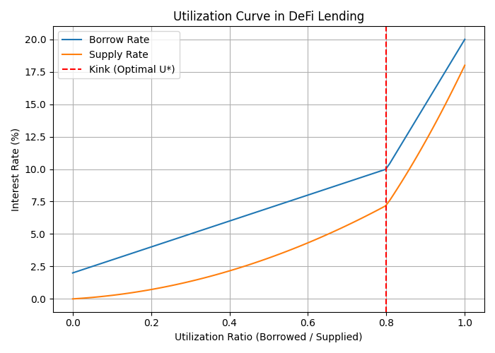

# Reinforcement Learning in Virtual Economies: 

## Table of Contents
- [Governing DeFi with AI](#Governing-DeFi-with-AI)  
- [DeFi vs Traditional Finance: Lending by Numbers](#defi-vs-traditional-finance-lending-by-numbers)  
- [The Utilization Curve: How Interest Rates Work in DeFi](#the-utilization-curve-how-interest-rates-work-in-defi)  
- [Loan-to-Value (LTV) and Overcollateralization](#loan-to-value-ltv-and-overcollateralization)  
- [Why RL in DeFi Governance?](#why-rl-in-defi-governance)  
- [The RL Workflow in DeFi](#the-rl-workflow-in-defi)  
- [Results: RL vs Rule-Based Governance](#results-rl-vs-rule-based-governance)  
- [Conclusion](#conclusion)  
- [References](#references)  

---

## Governing DeFi with AI
Virtual economies are no longer confined to video games. With the rise of **cryptocurrencies** and **Decentralized Finance (DeFi)**, we now have financial ecosystems that exist entirely on-chain. These systems facilitate lending, borrowing, and trading without traditional intermediaries like banks. Instead, they rely on **smart contracts**—self-executing code deployed on blockchains.  

However, these protocols are still governed by **human decisions**—developers and communities vote to set critical parameters like interest rates, collateral requirements, and liquidation thresholds. This manual governance process is slow, biased, and often ill-suited to crypto’s volatile markets.  

This is where **Reinforcement Learning (RL)** comes in. RL agents can continuously monitor markets, simulate outcomes, and automatically adjust parameters to optimize long-term outcomes such as **profitability, liquidity stability, and resilience to attacks**. Two recent works exemplify this direction:  

- **Auto.gov**: An RL-based governance agent that dynamically adjusts risk parameters like collateral factors to prevent insolvency and resist price oracle attacks.  
- **From Rules to Rewards**: An RL framework that learns to adjust interest rates in Aave lending pools, outperforming static rule-based models under stress scenarios like the 2021 crash and the 2023 USDC depeg.  

---

## DeFi vs Traditional Finance: Lending by Numbers
To understand why RL is valuable, let’s first compare **traditional finance (TradFi)** and **DeFi lending**.

### Traditional Lending (Bank Example)
- You want to borrow $1000.  
- The bank checks your **credit score** and income.  
- If approved, you deposit collateral (e.g., your car worth $2000).  
- You borrow at a fixed **interest rate** (say 8% annually).  
- If you default, the bank repossesses your car.  

Key point: Banks rely on **creditworthiness** and **legal enforcement**.

### DeFi Lending (Aave Example)
- Alice deposits **$100 ETH** into Aave.  
- Protocol sets **Loan-to-Value (LTV) = 70%**.  
- Alice can borrow **$70 USDC**.  
- If ETH price drops 40% (her $100 ETH is now worth $60), her **collateral value < debt**.  
- Smart contract **liquidates** her position automatically, selling her ETH to repay lenders.  

Key point: DeFi relies on **overcollateralization and liquidation bots**, not credit checks.

---

## The Utilization Curve: How Interest Rates Work in DeFi
One of the most important mechanisms in DeFi lending is the **utilization curve**, which governs how interest rates change depending on market demand.

### Utilization Ratio
$$
U = \frac{\text{Total Borrowed}}{\text{Total Supplied}}
$$

- **Low Utilization (U close to 0):**  
  Few borrowers, plenty of liquidity. Interest rates stay low to encourage borrowing.  

- **High Utilization (U close to 1):**  
  Most liquidity is borrowed, very little remains. Rates increase sharply to discourage borrowing and attract more deposits.  

### Example
- Total Supplied = **1000 USDC**  
- Total Borrowed = **700 USDC**  
- Utilization = 700 / 1000 = **70%**

At 70%, the **borrow rate** might be 8% and the **deposit rate** 5%. If utilization rises to 90%, the borrow rate could spike to 25% to prevent liquidity shortages.  

This creates a **kinked utilization curve**:  
- Smooth slope at low utilization.  
- Sharp increase after a threshold (e.g., 80%).  

Such dynamics are crucial but also **rigid** when hard-coded into smart contracts. RL offers a way to **adapt these curves dynamically**.

---

## Loan-to-Value (LTV) and Overcollateralization
In DeFi, loans are **overcollateralized** to protect lenders.

- **Loan-to-Value (LTV):**  
  Ratio of borrowed amount to collateral value.  

$$
\text{LTV} = \frac{\text{Loan Value}}{\text{Collateral Value}}
$$

- **Overcollateralization:**  
  Borrowers must deposit more than they borrow.  

### Example 1 – Safe Position
- Deposit = **$200 ETH**  
- LTV = 70%  
- Max Borrow = $140 USDC  
- Actual Borrow = $100 USDC  
- LTV = 50% → Safe position.

### Example 2 – Risky Position
- Same deposit = $200 ETH  
- Borrow = $140 USDC  
- ETH price falls 30% → Collateral now worth $140.  
- New LTV = 100% → Position is liquidated.  

Liquidation prevents systemic insolvency but can be **brutal for borrowers**. RL can help by **tuning liquidation thresholds and collateral factors dynamically** to balance risk and efficiency.

---

## Why RL in DeFi Governance?
Currently, DeFi governance relies on:
1. **Manual proposals** in forums.  
2. **Community voting** (governance tokens).  
3. **Implementation delays** (days or weeks).  

Problems:  
- **Too slow** for volatile markets.  
- **Centralized in practice** (whales dominate votes).  
- **Static rules** ignore market stress.  

RL provides:  
- **Adaptive governance** → protocols adjust within minutes, not weeks.  
- **Objective optimization** → maximize profitability and stability.  
- **Resilience to attacks** → respond in real time to flash loan or oracle exploits.  

Example: Auto.gov prevented losses from simulated **oracle attacks** that drained protocols like bZx and Cream Finance.

---

## The RL Workflow in DeFi
Reinforcement Learning models DeFi as a **Markov Decision Process (MDP)**.

1. **States (S):**  
   Market conditions like tokens' prices, utilization, liquidity, collateral ratios, volatility.  

2. **Actions (A):**  
   Adjust parameters (e.g., interest rates, collateral factor, liquidation threshold).  

3. **Rewards (R):**  
   Objectives such as:  
   - Maximize protocol profitability.  
   - Maintain liquidity efficiency.  
   - Minimize bad debt.  

4. **Policy (π):**  
   The agent’s learned strategy for choosing actions.  

### Offline RL
- Trains on **historical data** (e.g., Aave v2/v3).  
- Safe: no risk of experimenting live.  
- Example: TD3-BC learned to preemptively adjust rates during the **USDC depeg** in 2023.

### Online RL
- Uses **simulated environments** (e.g., Auto.gov modeled Aave-like lending pools).  
- RL agents explore and learn in simulation.  
- Once trained, policies can be deployed on-chain.  

---

## Results: RL vs Rule-Based Governance
### Profitability
- Auto.gov paper improved profitability by **60%+** in simulations and 10x over static baselines.

### Stress Events
- TD3-BC reacted faster to the **FTX collapse (2022)** and **ETH crash (2024)** than Aave’s rules, improving liquidity provider retention.

### Capital Efficiency
- RL produced **smoother rate curves**, reducing shocks for borrowers and improving returns for depositors.  
- Prevented excessive underutilization or overexposure.

### Governance Agility
- RL adapts in **hours**, while DAO votes take **weeks**.  
- Reduces vulnerability to manipulation and slow decision-making.

---

## Conclusion
DeFi represents the world’s largest experiment in algorithmic finance. But its governance still relies heavily on human decision-making, leaving it exposed to **bias, rigidity, and systemic risk**.  

Reinforcement Learning offers a way forward:  
- **Offline RL** learns from history.  
- **Online RL** simulates future markets.  
- Together, they provide **adaptive, attack-resistant governance**.  

As shown in **Auto.gov** and **TD3-BC**, RL-based agents outperform static rule-based models, improving profitability, liquidity, and systemic resilience.  

In many ways, RL could serve as the **central bank of DeFi**—a governor that adjusts policy dynamically, balancing borrower needs with lender rewards, ensuring that decentralized economies remain stable and sustainable.

## References
1. Xu, J., Feng, Y., Perez, D., & Livshits, B. (2025). **Auto.gov: Learning-based Governance for Decentralized Finance (DeFi)**. *IEEE Transactions on Services Computing*. [arXiv:2302.09551](https://arxiv.org/abs/2302.09551).  

2. Qu, H., Gogol, K. M., Grötschla, F., & Tessone, C. J. (2025). **From Rules to Rewards: Reinforcement Learning for Interest Rate Adjustment in DeFi Lending**. *arXiv preprint*. [arXiv:2506.00505](https://arxiv.org/abs/2506.00505).  
