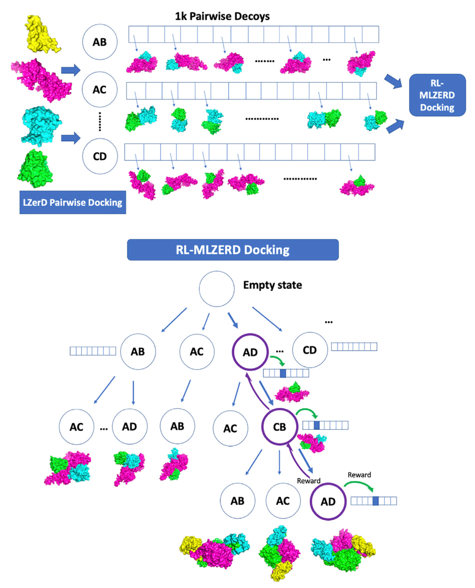
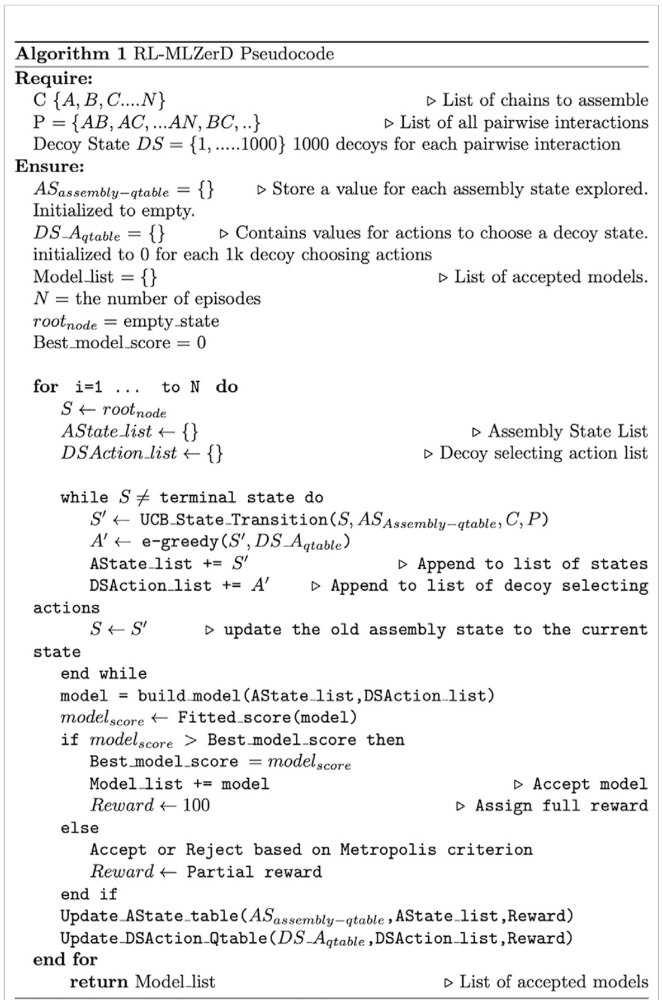
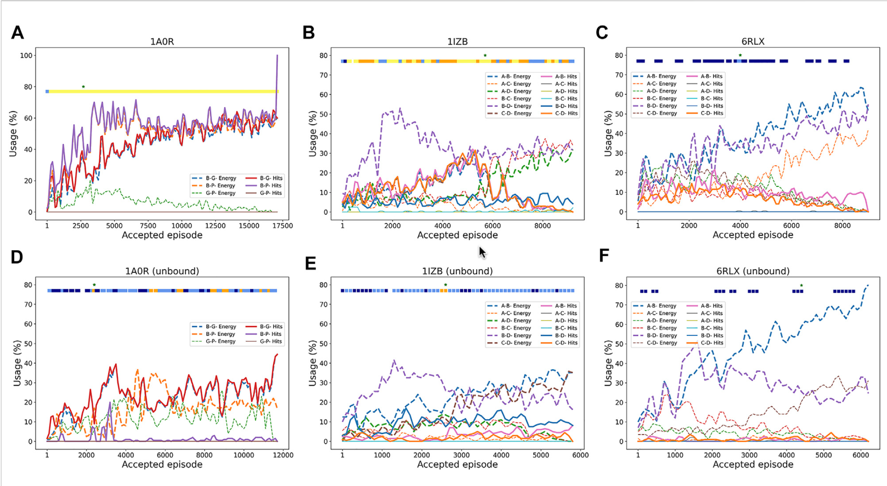
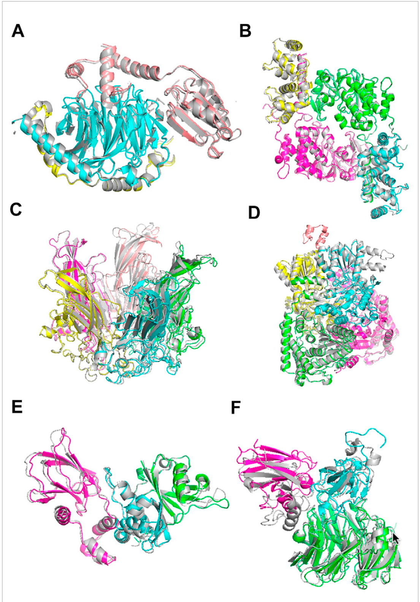

Understanding how proteins interact is crucial for decoding cellular processes. Traditional experimental approaches like X-ray crystallography and cryo-EM provide detailed structures, but they are costly and time-consuming. Computational docking has stepped in to complement these methods, yet most tools focus only on **pairwise docking**. Enter **RL-MLZerD**, a reinforcement learning-based framework for multimeric protein docking.

---

## Why Multimeric Docking Matters?
Proteins rarely work alone—they form **complexes with multiple chains**. Predicting these multimeric assemblies computationally is challenging due to the combinatorial explosion of possible conformations. Earlier methods like **CombDock** and **Multi-LZerD** tackled this problem, but they either relied on genetic algorithms or symmetry assumptions, limiting accuracy.

**RL-MLZerD** reframes docking as a **reinforcement learning (RL) problem**, treating the assembly process as a sequence of decisions where an agent learns to select the best pairwise docking decoys to form a full complex.

---

## Dataset construction

The authors benchmarked RL-MLZerD on 30 protein complexes (3–5 chains each) selected from the Protein Data Bank. They excluded DNA/RNA-containing assemblies and very short chains (<10 residues). To avoid bias, subunits were rotated and shifted away from their PDB orientations.

---

## The RL-MLZerD Workflow

The approach works in two main stages:

1. **Pairwise Docking** – Using LZerD, thousands of decoy structures for each subunit pair are generated and clustered.  
For each subunit pair, LZerD generated hundreds of thousands of models. These were clustered at 4.0 Å Cα RMSD, with the best-scoring representative retained. Using multiple random orientations of subunits, they created a pool of 1,000 diverse pairwise decoys per subunit pair. These decoys were then input to the RL stage
2. **Reinforcement Learning Assembly** – The RL agent selects and assembles these pairwise decoys, learning which combinations yield physically plausible complexes.

---

## RL-Based Assembly

In my poster session, I explained the **reinforcement learning workflow** behind RL-MLZerD:

- **Episodes**: A docking episode begins with an empty complex and grows by adding subunits step by step.
  - **Assembly state selection (UCB)**:  
    $$
    UCB_i = v_i + C \sqrt{\frac{\ln N}{n_i}}
    $$ 
    where $v_i$ is the value of state $i$, $N$ the visits to the parent, $n_i$ the visits to $i$, and $C$ a decaying exploration parameter.
  - **Decoy state selection ($\varepsilon$-greedy)**: The agent exploits the best decoy with probability $1 - \varepsilon$, or explores a random one with probability $\varepsilon$, gradually reducing $\varepsilon$.

- **Rewards**:  
  - Best model so far $\rightarrow$ **+100**  
  - Near-best model $\rightarrow$ accepted with probability (Metropolis Criterion)
    $$
    P = \exp \left(-\frac{\Delta E}{k_b T}\right), \quad k_bT = 6.0
    $$ 
    or, alternatively, a constant $P = 0.6$.  
  - Rejected but geometrically valid $\rightarrow$ **+10**  
  - High clash rejection $\rightarrow$ **−2**

- **Value updates**:  
  - Assembly states:  
    $$
    v_i \leftarrow v_i + \eta r_t, \quad n_i \leftarrow n_i + 1
    $$  
  - Decoy states: Temporal difference learning:  
    $$
    Q(s,a) \leftarrow Q(s,a) + \alpha \big[ R(s,a) + \gamma \max_{a'} Q(s',a') - Q(s,a) \big]
    $$  
    with $\alpha$ adaptive and $\gamma = 0.25$.

- **Outcome**: $\sim$ 1,500–12,000 models are generated per target, clustered, and ranked with a composite scoring function (molecular mechanics, solvent accessible surface area, radius of gyration, clash penalties, plus VoroMQA).

This RL approach balances **exploration of new assembly paths** with **exploitation of promising candidates**, making docking more efficient and accurate.

Below you can see the RL-MLZerD Pseudocode.

---

## Results: Bound vs. Unbound Docking

The method was benchmarked on **30 protein complexes (3–5 chains each)**. Results showed:

- **Bound Docking** In bound tests (experimental subunit structures), RL-MLZerD generated near-native complexes for 80% of targets with RMSD < 8 Å. It outperformed Multi-LZerD and CombDock on the same dataset.

- **Unbound Docking** (using predicted subunit structures): When using modeled subunits (via MODELLER or I-TASSER), performance dropped: average RMSD increased to 6.3 Å. Still, RL-MLZerD beat Multi-LZerD and CombDock on most targets. Some difficult targets had RMSD >10 Å, highlighting the challenge of modeling from less accurate subunits.

| Metric              | RL-MLZerD   | M-LZerD     | CombDock    |
|---------------------|-------------|-------------|-------------|
| Bound Avg. (Å)      | 4.64 (2.50) | 7.83 (4.27) | 18.21 (15.50) |
| Bound ≤ 8.0 Å       | 24 (28)     | 17 (24)     | 1 (1)       |
| Unbound Avg. (Å)    | 10.75 (6.30)| 16.16 (7.50)| 19.61 (16.31) |
| Unbound ≤ 8.0 Å     | 13 (22)     | 5 (16)      | 1 (1)       |

---

## Comparison with AlphaFold

While **AlphaFold-Multimer** remains stronger in most unbound cases, RL-MLZerD offers advantages in **predicting docking order** and **exploring alternative assemblies**. Importantly, RL-MLZerD produced **competitive results** without the need for extensive deep learning retraining.

| Metric        | RL-MLZerD (b) | RL-MLZerD (u) | ColabFold | AF-Multimer | AF-Multimer (nt) |
|---------------|---------------|---------------|-----------|-------------|------------------|
| Avg. (Å)      | 4.64 (2.50)   | 10.75 (6.30)  | 6.54      | 3.46        | 4.21             |
| ≤ 8.0 Å       | 24 (28)       | 13 (22)       | 22        | 26          | 25               |

---

## Decoy Usage Across RL Episodes

This figure shows how the RL agent selects pairwise decoys over the course of docking episodes. Each plot tracks which decoys were chosen and how their quality (measured by RMSD or energy) changes as more episodes are run.

- In 1A0R (3 chains, bound), the agent increasingly prioritized “hit” decoys (within 4 Å of the native structure). As episodes progressed, the usage of good decoys grew, and near-native complexes (<2 Å RMSD) were consistently produced.

- In 1IZB (4 chains, bound), the agent initially discovered correct A–B and C–D decoys, which led to a very accurate model. But later episodes drifted toward low-energy but incorrect decoys, showing how energy scores can sometimes mislead the search.

- In 6RLX (4 chains, bound), the agent mainly selected low-energy decoys that were not close to the native structure. As a result, the models generated stayed far from the correct assembly.

- The unbound counterparts (D–F) show similar patterns, but with reduced accuracy. For example, in unbound 1A0R, good decoys were still identified around the 3,500th episode, leading to the best model, while in unbound 1IZB and 6RLX, the signal was weaker and performance degraded.

Overall, this figure highlights how reinforcement learning dynamically balances exploration and exploitation: when the scoring function aligns with structural correctness, RL converges to near-native models; when scoring is misleading, the agent may get trapped by low-energy but incorrect decoys.

  

---
## Visual examples of RL-MLZerD’s docking results across complexes of different sizes

This figure shows the strength of RL-MLZerD in handling both bound and unbound docking, its ability to produce near-native solutions for many targets, and also its limitations in small or ambiguous binding interfaces. The native (experimentally solved) structures are shown in grey, while RL-MLZerD’s predictions are color-coded by chain.

The figure highlights successes across 3, 4, and 5-chain assemblies:

#### A) 1A0R (3 chains) – RL-MLZerD reconstructed the complex almost perfectly (RMSD 0.87 Å).

#### B) 3LL8 (4 chains) – Again, near-native accuracy with RMSD 1.31 Å, while AlphaFold-Multimer misassembled the dimer-of-dimers.

#### C) 1CN3 (5 chains) – Despite the added complexity, RL-MLZerD achieved an RMSD of 1.42 Å.

#### D) 1W85 (5 chains) – A tougher case where the algorithm misidentified a small subunit’s binding site, leading to a higher RMSD of 7.43 Å.

#### E and F) 1VCB and 2H47 (unbound cases) – Even when starting from modeled subunits with deviations from the native, RL-MLZerD assembled accurate complexes (RMSD 1.76 Å and 4.54 Å, respectively).

---

## Predicting Assembly Order

A unique strength of RL-MLZerD is its ability to **predict the order in which protein chains assemble**. By analyzing the preferred RL paths, the method achieved **76.5% accuracy** in reconstructing known assembly sequences.

---

## Real World Application

Targeted drug development can be revolutionized by understanding how protein complexes form. By pinpointing the exact assembly pathway, we can design drugs that disrupt the complex at a precise stage. While experimental methods are costly, the RL-MLZerD algorithm can predict these pathways with high accuracy, providing fast, affordable insights that empower researchers to develop next-generation therapeutics.

---

## Conclusion

RL-MLZerD highlights the potential of reinforcement learning beyond games and robotics bringing it into **structural biology**. By efficiently navigating the combinatorial docking space, it opens new avenues for understanding protein complexes and their functional mechanisms.

---

## References

- Aderinwale T., Christoffer C., & Kihara D. (2022). *RL-MLZerD: Multimeric protein docking using reinforcement learning*. Frontiers in Molecular Biosciences, 9:969394. [https://doi.org/10.3389/fmolb.2022.969394](https://doi.org/10.3389/fmolb.2022.969394)  
- Evans R. et al. (2021). *Protein complex prediction with AlphaFold-Multimer*. bioRxiv. [https://doi.org/10.1101/2021.10.04.463034](https://doi.org/10.1101/2021.10.04.463034)  
- Jumper J. et al. (2021). *Highly accurate protein structure prediction with AlphaFold*. Nature, 596, 583–589. [https://doi.org/10.1038/s41586-021-03819-2](https://doi.org/10.1038/s41586-021-03819-2)  
- Mirdita M. et al. (2021). *ColabFold: Making protein folding accessible to all*. bioRxiv. [https://doi.org/10.1101/2021.08.15.456425](https://doi.org/10.1101/2021.08.15.456425)  
- Kocsis L., & Szepesvári C. (2006). *Bandit based Monte-Carlo planning*. ECML. Springer.  
