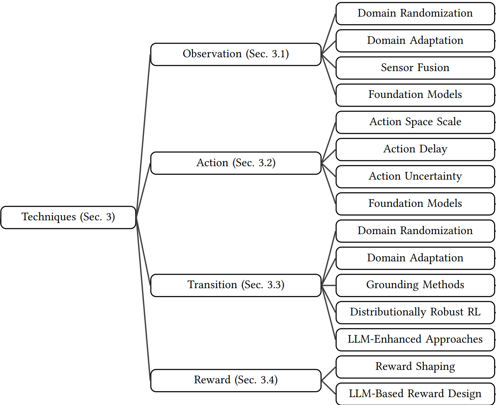
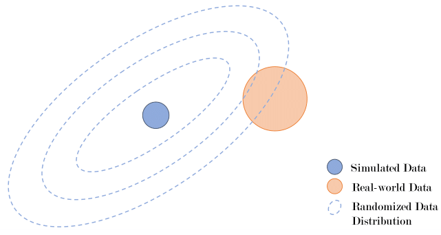
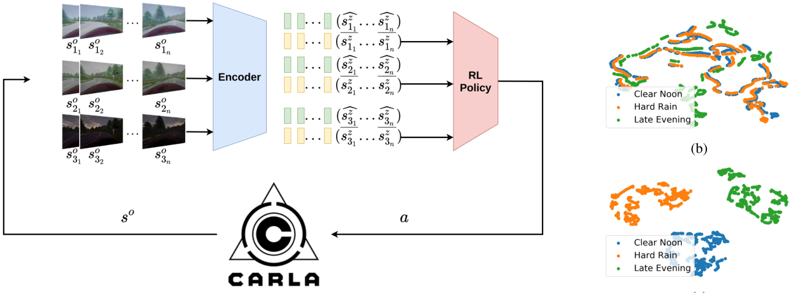
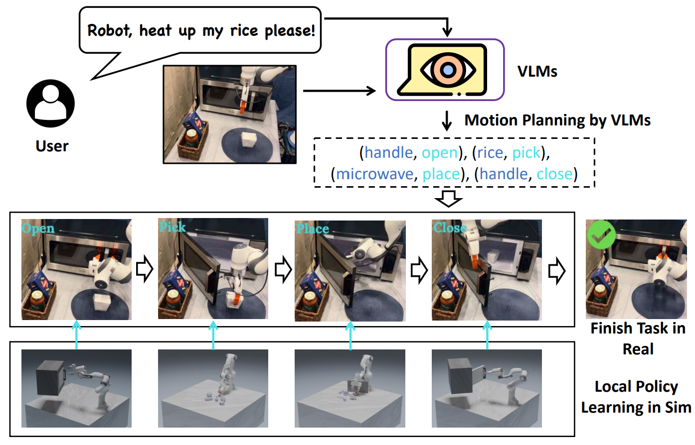

## Motivation
Robots act in **complex, uncertain** worlds. Traditional control relies on hand-designed models. Deep RL offers:
- End-to-end policies from perception → action
- Trial-and-error learning
- Potential for general-purpose autonomy

But transferring from simulation to physical robots exposes the **Sim-to-Real gap**.

## Sim-to-Real Gap
**Definition:** For a simulator-trained policy $\pi^s$ evaluated by metric $\psi$:

$$G(\pi) := \psi_s(\pi^s) - \psi_r(\pi^s)$$

This gap captures how much performance drops when moving from simulation (s) to reality (r).

**Causes:**
- **Observation gap:** noise, partial observations, sensor resolution.
- **Action gap:** latency, discretization vs continuous control.
- **Transition gap:** differences in dynamics ($P_s \neq P_r$).
- **Reward gap:** reward functions may not reflect reality.

➡️ **Example:** A quadruped robot trained in sim to walk forward may overfit to friction values of the simulator. In reality, even a small mismatch in surface friction can cause slipping and falling.

## Simulation vs Reality
**Simulation advantages:**
- Safe, low-cost, scalable data collection
- Unlimited training samples
- Parallel and fast experiments

**Real-world challenges:**
- Safety during trials
- High experimental cost
- Slow/limited data collection
- Unexpected or dangerous behaviors

## Techniques Overview
- **Observation:** Domain Randomization (DR), Domain Adaptation (DA), Sensor Fusion, Foundation Models
- **Action:** Action scaling, delay modeling, uncertainty injection, FM-based planners
- **Transition:** DR, DA, grounding methods, distributionally robust RL, LLM-augmented approaches
- **Reward:** Reward shaping, LLM-based design

## System Identification
- Build precise models of real system dynamics
- Calibrate simulator with physical measurements
- Improves realism but residual gaps persist

**Challenge:** even well-calibrated systems drift due to wear, temperature, or sensor misalignment.

➡️ **Formula:** Suppose simulator uses $m_s$ for mass while reality uses $m_r$. Even small mismatch $(m_s - m_r)$ propagates to torque computation: 

$$\tau = I\ddot{\theta} + m g l \sin(\theta)$$

An incorrect $m$ leads to wrong torques, destabilizing control.

## Domain Randomization
- Randomize visuals (textures, lighting) and physics (masses, friction, damping)
- Train policies robust across many worlds

**Case study:** OpenAI’s dexterous hand manipulation → randomizing object mass, surface friction, and textures enabled real-world cube rotation.

⚠️ Excessive randomization destabilizes RL training → use curriculum-based **Automatic Domain Randomization (ADR)**.

## Domain Adaptation
- Align features from sim (source) and real (target)
- Approaches:
  - **Discrepancy-based:** align feature distributions (MMD, CORAL)
  - **Adversarial-based:** domain-invariant encoders
  - **Reconstruction-based:** shared latent representations

➡️ **Example:** Latent Unified State Representation (LUSR) disentangles domain-general and domain-specific features. Policies trained on domain-general embeddings generalize better.

## Foundation Models in Sim-to-Real
- **Observation:** Vision-Language Models extract semantic scene graphs, robust to sim/real mismatch
- **Action:** LLMs chain low-level skills (grasp, push, open) into long-horizon plans
- **Transition:** FM-based predictors reduce dynamics mismatch
- **Reward:** Text-to-reward shaping from LLM prompts

➡️ **Formula (reward shaping with LLM):**

$$r'(s,a) = r(s,a) + \lambda f_{LLM}(s,a)$$

where $f_{LLM}$ is an auxiliary reward suggested by natural language description.

## Future Directions
- Hybrid transfer: DR + DA, adversarial curricula
- Continual and on-robot adaptation
- Distributionally robust RL and uncertainty-aware control
- FM-centric perception, planning, reward pipelines
- New evaluation metrics and safer testbeds
- Formal explanations and safety guarantees

> **Open challenge:** Bridge *formal guarantees* with *scalable practice* for robust, safe, FM-augmented RL on real robots.

## References
- Zhao, Wenshuai, Jorge Peña Queralta, and Tomi Westerlund. *Sim-to-real transfer in deep reinforcement learning for robotics: a survey.* IEEE SSCI, 2020. [@survey1]
- Salvato, Erica, Gianfranco Fenu, Eric Medvet, and Felice Andrea Pellegrino. *Crossing the reality gap: A survey on sim-to-real transferability of robot controllers in RL.* IEEE Access 9 (2021): 153171–153187. [@survey2]
- Da, Longchao, Justin Turnau, Thirulogasankar Pranav Kutralingam, Alvaro Velasquez, Paulo Shakarian, and Hua Wei. *A survey of sim-to-real methods in RL: Progress, prospects and challenges with foundation models.* arXiv:2502.13187, 2025. [@survey3]
