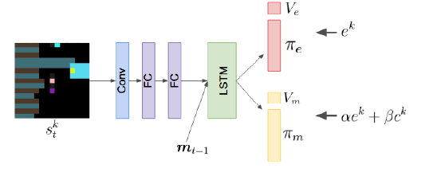
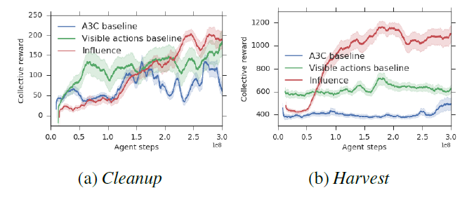
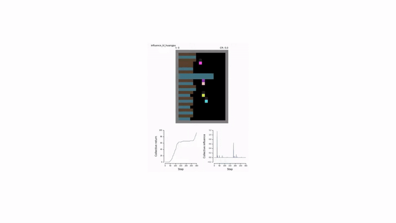
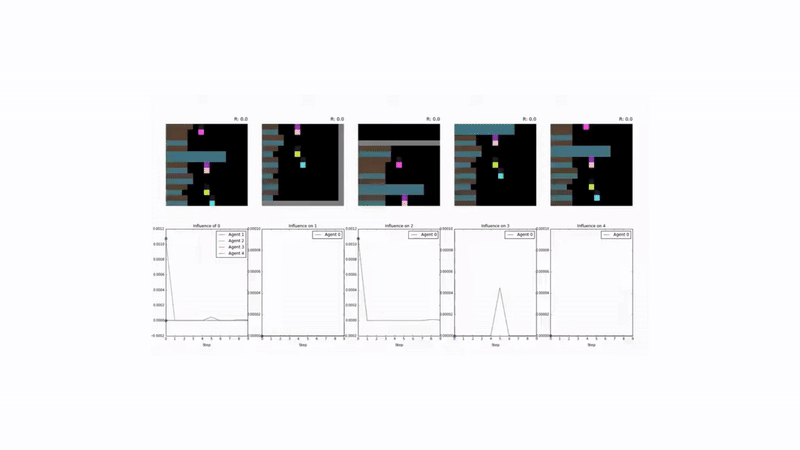
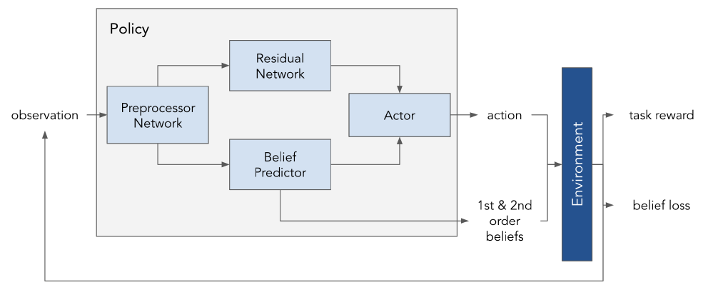
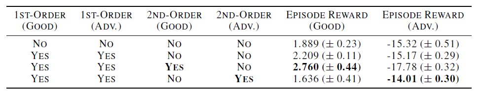

## The Challenge of Multi-Agent Coordination 🤖

In multi-agent reinforcement learning (MARL), agents trained to maximize their individual rewards often fail to achieve effective collaboration. This "selfish" optimization can lead to suboptimal group outcomes, especially in scenarios requiring complex coordination.

Real-world applications, however—from autonomous vehicle fleets to robotic logistics—depend on seamless cooperation. The key to unlocking this capability may lie in **intrinsic motivation**: supplementing the standard task-based rewards with internal signals that encourage socially intelligent behaviors.

This post examines two influential papers that leverage this concept, charting a course from encouraging agents to *impact* one another to enabling them to *understand* one another.

1.  **Social Influence as Intrinsic Motivation** (Jaques et al., 2019): Proposes a method to reward agents for having a causal effect on the actions of their peers.
2.  **Theory of Mind as Intrinsic Motivation** (Oguntola et al., 2023): Advances this idea by rewarding agents for accurately modeling the internal beliefs of others.

---

## Paper 1: Social Influence as Intrinsic Motivation

### The Motivation: The Need for Impactful Actions 🤔

In many MARL settings, agents learn to treat others as static parts of the environment. The core insight of this work is both simple and powerful:

> **Meaningful coordination is predicated on the ability of agents to mutually affect one another's behavior.**

An action is only socially relevant if it influences the decisions of others. This paper proposes a framework to directly incentivize such behavior by rewarding an agent for its **causal influence** on other agents. This pushes agents to develop policies that are not only effective for themselves but are also legible and responsive to their partners, creating a foundation for coordination and emergent communication.

### The Algorithm: Quantifying Influence 📏

The method for measuring influence is rooted in **counterfactual reasoning**. At each step, an agent assesses how its chosen action altered the behavior of another agent compared to a baseline of what that agent would have done otherwise.

The algorithm proceeds as follows:
1.  **Conditional Policy:** For a given state, agent $j$ forms its action plan (policy) based on the *actual* action, $a_t^k$, taken by agent $k$. This is the conditional policy distribution, $p(a_t^j | a_t^k, s_t^j)$.
2.  **Counterfactual Baseline:** To determine what agent $j$ would have done without $k$'s specific influence, a baseline policy is constructed. This is done by simulating multiple *alternative actions* that agent $k$ could have taken (sampled from its own policy) and averaging agent $j$'s resulting plans. This produces the marginal policy, $p(a_t^j | s_t^j)$, which represents agent $j$'s behavior in the absence of specific information about $k$'s action.
3.  **Measuring the Difference:** The "influence" is the divergence between the conditional policy and the counterfactual baseline.

This divergence is quantified using the **Kullback-Leibler (KL) divergence**. The intrinsic influence reward for agent $k$, denoted $c_t^k$, is the sum of its influence on all other agents in the environment:

$$c_t^k = \sum_{j \neq k} D_{KL}\!\Big[p(a_t^j \mid a_t^k, s_t^j) \;\Big\|\; p(a_t^j \mid s_t^j)\Big]$$

This intrinsic reward is then combined with the extrinsic (environment) reward $e_t^k$ to form the total reward used for learning:

$$r_t^k = \alpha e_t^k + \beta c_t^k$$

The hyperparameters $\alpha$ and $\beta$ balance the agent's focus between task completion and social influence. Notably, this influence reward is mathematically related to maximizing the **mutual information** between agents' actions, providing a strong theoretical basis for encouraging coordinated behavior.

### Test Environments: Sequential Social Dilemmas

The effectiveness of this approach was tested in two challenging social dilemma environments:
* **Cleanup:** A public goods game where agents must clean a shared river for resource-spawning apples to appear.
* **Harvest:** A common-pool resource game where agents must harvest apples sustainably to prevent resource depletion.

### Results and Emergent Behavior 🤝

Agents trained with the social influence reward demonstrated superior performance:
* **Enhanced Cooperation:** They consistently achieved higher collective rewards by learning to solve the underlying social dilemmas in both *Cleanup* and *Harvest*.
* **Emergent Signaling:** Agents developed implicit communication strategies. For example, an "influencer" agent learned to signal the availability of apples by moving, and its stillness was correctly interpreted by others as a lack of resources.

Furthermore, when agents were given an explicit communication channel, rewarding influential *messages* was sufficient to drive the emergence of meaningful communication protocols, even in the absence of extrinsic task rewards for communication.

---

## Paper 2: Theory of Mind as Intrinsic Motivation

### The Motivation: From Behavior to Beliefs 🧠

Social influence focuses on affecting observable *behavior*. However, human social reasoning is more profound; we infer the unobservable *mental states*—beliefs, desires, and intentions—of others. This capacity is known as **Theory of Mind (ToM)**.

This research explores a powerful question:
> **Can we equip agents with an intrinsic drive to model the beliefs of others, and does this lead to more sophisticated social intelligence?**

The objective is to reward agents for accurately predicting other agents' internal representations of the world. This not only promotes predictable and coordinated behavior but also enables complex strategies involving deception and strategic information sharing.

### The Algorithm: Modeling Beliefs

The proposed method involves several interconnected components within each agent's policy network:

1.  **A Structured Belief Representation:** The agent's perception of the environment is channeled through a **concept bottleneck**. This forces the network to first generate a low-dimensional, interpretable **Belief Vector ($b$)**, representing semantically meaningful concepts (e.g., "Which landmark is the target?"). This vector is trained with a supervised loss (e.g., Mean Squared Error or Cross-Entropy) against ground-truth state information.

2.  **A Residual Network:** Because predefined concepts cannot capture all nuances of the environment, a parallel **Residual Vector ($z$)** is learned. This vector serves as a compressed representation of any information not contained in the belief vector.

3.  **Belief Disentanglement:** A critical challenge is ensuring the network actually uses the belief vector, rather than encoding all necessary information in the untyped residual vector. To prevent this, the model is trained to minimize the **mutual information ($I$)** between the belief and residual vectors:

    $$I(B;Z) = D_{KL}(P_{BZ} \,\|\, P_B \otimes P_Z)$$

    This loss term acts as a regularizer, forcing the two representations to be decorrelated and preserving the semantic integrity of the belief vector.

4.  **Second-Order Belief Prediction:** The core of the intrinsic motivation comes from a "ToM" module. This module takes the agent's own state observation and predicts the belief vector of *other agents*. The intrinsic reward, $r_{\text{tom}}$, is the negative prediction error of this task:

    $$r_{\text{tom}} = - \frac{1}{K} \sum_{j=1}^K \text{MSE}(B_i, b^{(j)})$$

    Here, $B_i$ is agent $i$'s prediction of agent $j$'s beliefs. This reward incentivizes agents to form accurate models of others' minds and to behave in ways that make their own beliefs more predictable.

The final policy is trained by optimizing a composite objective function that combines the standard RL loss (PPO), the supervised belief loss, and the mutual information regularizer.

### Test Environment: Physical Deception

The model was evaluated in a mixed cooperative-competitive environment where:
* **Good agents** must coordinate to reach a target landmark.
* An **adversary** attempts to identify and intercept them at the target.

Success requires the good agents to coordinate while actively deceiving the adversary.

### Results: Sophisticated Social Strategies 🕵️‍♂️

The ToM-based intrinsic reward led to a marked improvement in strategic depth:
* **Superior Coordination and Deception:** "Good" agents with the ToM reward significantly outperformed baselines, learning complex strategies like feinting towards incorrect landmarks to mislead the adversary.
* **Improved Adversarial Reasoning:** When the adversary was also equipped with the ToM reward, it became more decisive and effective at inferring the true target.

These results indicate that motivating agents to model beliefs fosters a deeper level of social reasoning applicable to both cooperative and competitive dynamics.

---

## 💡 Conclusion: The Path to Socially Aware AI

These two papers illustrate a clear and promising trajectory in MARL. By shifting the focus from purely extrinsic, task-based rewards to intrinsic motivations, we can encourage agents to learn the fundamentals of social intelligence autonomously.

* **Social Influence** provides a behavioral foundation, rewarding agents for being **impactful** and creating actions that are socially legible.
* **Theory of Mind** builds upon this with a cognitive layer, rewarding agents for being **aware** and modeling the internal states of others.

Together, these approaches demonstrate a principled way to develop MARL systems capable of navigating complex social dilemmas, learning to communicate effectively, and deploying adaptive strategies for collaboration and competition. They move us beyond programming simple rules and toward creating environments where social intelligence can truly emerge.

---

### Further Reading
- [Social Influence as Intrinsic Motivation for Multi-Agent Deep Reinforcement Learning (ICML 2019)](https://arxiv.org/abs/1810.08647)
- [Theory of Mind as Intrinsic Motivation for Multi-Agent Reinforcement Learning (2023)](https://arxiv.org/abs/2307.01158)